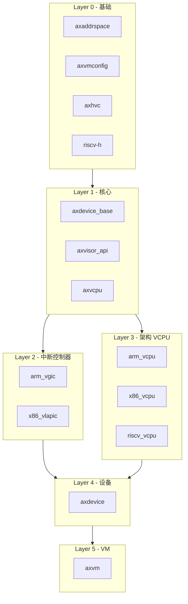

# axcrates

ArceOS Hypervisor 组件汇总仓库。

## 简介

本仓库是一个 **meta crate**，用于将 ArceOS Hypervisor 的所有组件打包发布到 crates.io，方便用户通过 `cargo clone` 获取完整的工作区。

## 项目结构

```
axcrates/
├── Cargo.toml              # 元包配置
├── README.md               # 本文档
├── src/lib.rs              # 元包库代码
├── bundle/
│   └── submodules.tar.gz   # 子模块压缩包
├── scripts/
│   ├── crates.txt          # crate 列表
│   ├── bundle.sh           # 打包子模块
│   ├── unpack.sh           # 解包子模块
│   ├── publish.sh          # 发布到 crates.io
│   ├── bump.sh             # 升级版本号
│   ├── commit.sh           # Git 提交推送
│   └── tag.sh              # Git 标签管理
├── arm_vcpu/               # AArch64 VCPU
├── arm_vgic/               # ARM VGIC
├── axaddrspace/            # 地址空间管理
├── axdevice/               # 设备抽象层
├── axdevice_base/          # 设备基础
├── axhvc/                  # HyperCall
├── axvcpu/                 # VCPU 抽象
├── axvm/                   # VM 管理
├── axvmconfig/             # VM 配置
├── axvisor_api/            # Hypervisor API
├── riscv_vcpu/             # RISC-V VCPU
├── riscv-h/                # RISC-V H 扩展
├── x86_vcpu/               # x86 VCPU
└── x86_vlapic/             # x86 vLAPIC
```

### 组件列表

| 组件 | 分类 | 描述 |
|------|------|------|
| axaddrspace | 核心 | Guest 地址空间管理，内存虚拟化 |
| axvmconfig | 核心 | VM 配置工具，TOML 格式支持 |
| axhvc | 核心 | HyperCall 定义，Guest-Hypervisor 通信 |
| axvcpu | 核心 | VCPU 抽象层，通用接口定义 |
| axvisor_api | 核心 | Hypervisor 基础 API |
| axdevice_base | 核心 | 设备模拟基础 trait |
| axdevice | 核心 | 设备抽象层 |
| axvm | 核心 | VM 资源管理 |
| arm_vcpu | AArch64 | ARM VCPU 实现 |
| arm_vgic | AArch64 | 虚拟中断控制器 |
| x86_vcpu | x86_64 | x86 VCPU 实现 (VMX) |
| x86_vlapic | x86_64 | 虚拟 Local APIC |
| riscv_vcpu | RISC-V | RISC-V VCPU 实现 |
| riscv-h | RISC-V | H 扩展寄存器定义 |

### 组件依赖关系图



### 维护者脚本

| 脚本 | 用法 | 说明 |
|------|------|------|
| `bundle.sh` | `bash scripts/bundle.sh` | 将所有子模块打包为 `bundle/submodules.tar.gz`，用于 crates.io 分发 |
| `unpack.sh` | `bash scripts/unpack.sh` | 从 `bundle/submodules.tar.gz` 解包子模块，恢复完整 workspace |
| `publish.sh` | `bash scripts/publish.sh` | 按依赖顺序发布所有 crate 到 crates.io（需先 `cargo login`） |
| `bump.sh` | `bash scripts/bump.sh 0.2.0` | 批量更新所有 crate 版本号 |
| `commit.sh` | `bash scripts/commit.sh "msg" [branch]` | Git 提交并推送到分支（支持新建 feature 分支） |
| `tag.sh` | `bash scripts/tag.sh v0.2.0` | 创建 Git 标签并推送（需在 main 分支执行） |

## 快速开始

### 环境要求

- Rust toolchain: `nightly-2025-05-20`
- 目标架构:
  - `aarch64-unknown-none-softfloat` (ARM64)
  - `x86_64-unknown-none` (x86_64)
  - `riscv64gc-unknown-none-elf` (RISC-V 64)
- 组件: `rust-src`, `llvm-tools`, `rustfmt`, `clippy`
- QEMU: `qemu-system-aarch64`, `qemu-system-x86_64`, `qemu-system-riscv64`

### 快速体验

通过 crates.io 下载源码并体验组件：

```bash
# 安装 cargo-clone
cargo install cargo-clone

# 下载并解包
cargo clone axcrates
cd axcrates
bash scripts/unpack.sh
```

查看组件文档：

```bash
# 查看核心组件文档
cd axvcpu
cargo doc --open

# 查看 ARM VCPU 文档
cd arm_vcpu
cargo doc --open --target aarch64-unknown-none-softfloat
```

### 开发调试

克隆仓库（推荐）：

```bash
git clone --recurse-submodules https://github.com/arceos-hypervisor/axcrates.git
cd axcrates
```

编译组件：

```bash
# 编译指定组件
cd axvcpu
cargo build

# 编译指定架构
cd arm_vcpu
cargo build --target aarch64-unknown-none-softfloat

cd riscv_vcpu
cargo build --target riscv64gc-unknown-none-elf

cd x86_vcpu
cargo build --target x86_64-unknown-none
```

运行测试：

```bash
# 运行单元测试（支持 std 的组件）
cd axdevice
cargo test

# 运行文档测试
cd axvisor_api
cargo test --doc
```

代码检查：

```bash
# 格式化
cargo fmt --check

# Clippy 静态检查
cargo clippy --target aarch64-unknown-none-softfloat
```

提交代码（分支保护工作流）：

```bash
# 1. 创建并提交到 feature 分支
bash scripts/commit.sh "feat: add new feature" feature-xyz

# 2. 在 GitHub 上创建 Pull Request

# 3. PR 合并后，切换到 main 分支并拉取最新代码
git checkout main
git pull

# 4. 创建标签（需在 main 分支上）
bash scripts/tag.sh v0.2.0
```

发布到 crates.io：

```bash
# 1. 升级版本号
bash scripts/bump.sh 0.2.0

# 2. 打包子模块
bash scripts/bundle.sh

# 3. 提交到 feature 分支并创建 PR
bash scripts/commit.sh "chore: release v0.2.0" release-v0.2.0
# ... PR 合并后 ...

# 4. 切换到 main，打标签并发布
git checkout main && git pull
bash scripts/tag.sh v0.2.0
cargo login
bash scripts/publish.sh
```

## 许可证

Apache-2.0
