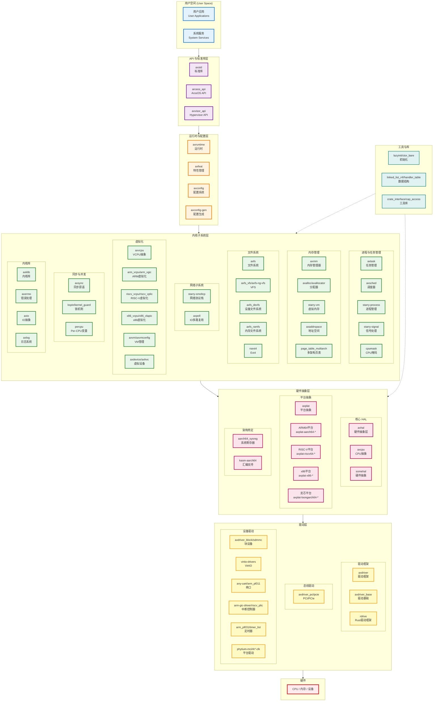
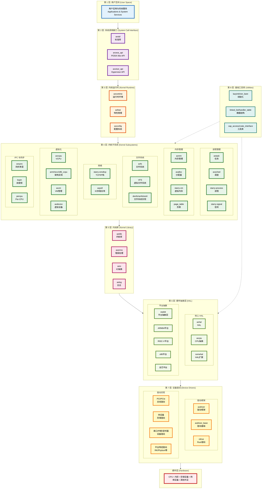
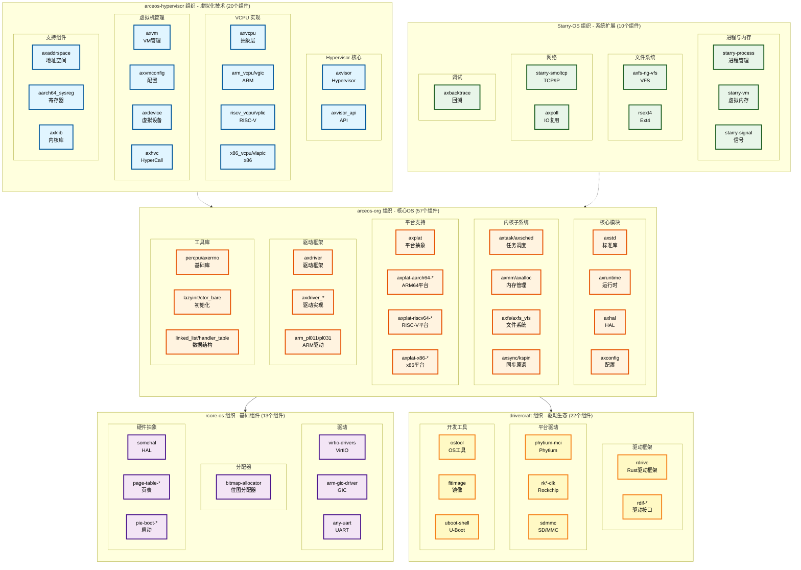

# ArceOS 生态系统架构图

本文档展示了 ArceOS 生态系统的完整架构，包括所有 121 个组件的位置和关系。

## 1. 完整操作系统架构图

## 2. 分层架构图（类似 Linux 内核架构）

### 层次说明

#### 第1层 - 应用层
- 用户应用和系统服务

#### 第2层 - 标准库与API
- `axstd`: ArceOS 标准库
- `arceos_api`: ArceOS API
- `axvisor_api`: Hypervisor API

#### 第3层 - 运行时与特性
- `axruntime`, `axfeat`: 运行时和特性管理
- `axconfig`, `axconfig-gen`: 配置系统

#### 第4层 - 内核核心服务
- **进程与任务**: `axtask`, `axsched`, `starry-process`, `starry-signal`
- **同步与并发**: `axsync`, `kspin`, `kernel_guard`
- **内核库**: `axklib`, `axerrno`, `axio`, `axlog`

#### 第5层 - 子系统
- **内存管理**: `axmm`, `axalloc`, `starry-vm`, `axaddrspace`, `page_table_multiarch`
- **文件系统**: `axfs`, `axfs_vfs`, `axfs_devfs`, `axfs_ramfs`, `rsext4`
- **网络**: `starry-smoltcp`, `axpoll`
- **虚拟化**: `axvcpu`, `arm_vcpu`, `riscv_vcpu`, `x86_vcpu`, `axvm`, `axdevice`

#### 第6层 - 硬件抽象层
- **核心HAL**: `axhal`, `axcpu`, `somehal`
- **平台抽象**: `axplat` + 6个平台实现(ARM64/RISC-V/x86/龙芯)
- **架构特定**: `aarch64_sysreg`, `kasm-aarch64`

#### 第7层 - 驱动层
- **驱动框架**: `axdriver`, `axdriver_base`, `rdrive`
- **总线驱动**: PCI/PCIe
- **设备驱动**: 块设备、VirtIO、串口、中断控制器、定时器等

#### 第8层 - 工具与库
- 初始化、数据结构、Per-CPU、工具库等

#### 第9层 - 开发工具
- `ostool`, `fitimage`, `jkconfig`, `uboot-shell`

## 3. 组织贡献分布图（按技术领域）

### 组织贡献统计

| 组织 | 组件数量 | Submodule 数量 | 主要贡献领域 |
|-----|---------|---------------|-------------|
| arceos-hypervisor | 20 | 19 | 虚拟化技术（Hypervisor、VCPU、VM管理） |
| arceos-org | 57 | 26 | 核心OS组件（内核、HAL、驱动、文件系统） |
| rcore-os | 13 | 5 | 基础组件（分配器、驱动、硬件抽象） |
| Starry-OS | 10 | 10 | 系统扩展（进程管理、网络、调试） |
| drivercraft | 22 | 0 | 驱动生态（驱动框架、平台驱动、开发工具） |
| **总计** | **121** | **60** | |

## 4. 操作系统核心组成部分

### 架构图说明

本文档包含三个不同视角的架构图：

1. **完整操作系统架构图**：展示所有组件的完整视图，从用户空间到硬件的垂直分层
2. **分层架构图**：类似 Linux 内核的 9 层架构，清晰展示各层职责
3. **组织贡献分布图**：按技术领域展示不同组织的贡献

这些图采用从上到下的分层设计，类似于传统操作系统架构图，便于理解组件间的依赖关系。

### 4.1 进程管理
- **starry-process**: 进程管理核心
- **axtask**: 任务管理
- **axsched**: 调度器
- **starry-signal**: 信号处理
- **cpumask**: CPU 掩码管理

### 4.2 内存管理
- **axmm**: 内存管理器
- **axalloc**, **axallocator**: 内存分配器
- **bitmap-allocator**: 位图分配器
- **starry-vm**: 虚拟内存管理
- **axaddrspace**: 地址空间管理
- **memory_set**: 内存区域集合
- **page_table_multiarch**: 多架构页表支持

### 4.3 文件系统
- **axfs**: 文件系统框架
- **axfs_vfs**, **axfs-ng-vfs**: 虚拟文件系统
- **axfs_devfs**: 设备文件系统
- **axfs_ramfs**: 内存文件系统
- **rsext4**: Ext4 文件系统

### 4.4 设备驱动
- **axdriver**: 驱动框架
- **串口驱动**: any-uart, arm_pl011
- **中断控制器**: arm-gic-driver, riscv_plic
- **VirtIO**: virtio-drivers
- **平台驱动**: RK3568, RK3588, Phytium 等

### 4.5 虚拟化
- **axvcpu**: VCPU 抽象层
- **架构实现**: arm_vcpu, riscv_vcpu, x86_vcpu
- **虚拟中断**: arm_vgic, riscv_vplic, x86_vlapic
- **VM 管理**: axvm, axvmconfig
- **虚拟设备**: axdevice, axhvc
- **Hypervisor API**: axvisor_api

### 4.6 网络
- **starry-smoltcp**: 网络协议栈
- **axpoll**: IO 多路复用

### 4.7 硬件抽象层
- **axhal**: 核心硬件抽象层
- **axcpu**: CPU 抽象
- **somehal**: 硬件抽象
- **axplat**: 平台抽象层
- **平台实现**: ARM64, RISC-V, x86, 龙芯等

### 4.8 同步与并发
- **axsync**: 同步原语
- **kspin**: 内核自旋锁
- **kernel_guard**: 临界区保护
- **percpu**: Per-CPU 变量

## 5. 架构特点

### 5.1 模块化设计
- 每个组件职责单一，接口清晰
- 通过 trait 定义抽象接口
- 支持多种实现替换

### 5.2 多架构支持
- ARM64 (aarch64)
- RISC-V 64
- x86_64
- LoongArch64

### 5.3 虚拟化支持
- 完整的 Hypervisor 实现
- 多架构 VCPU 支持
- 虚拟设备和中断控制器

### 5.4 可扩展性
- 从宏内核到微内核的灵活配置
- 支持多种文件系统
- 丰富的驱动生态

### 5.5 组件复用
- 跨项目共享组件
- 统一的接口标准
- 独立的版本管理

## 6. 操作系统实例

### 6.1 Axvisor
- **定位**: Type-1 Hypervisor
- **特点**: 
  - 基于组件化设计
  - 支持 ARM64, RISC-V, x86
  - 完整的虚拟化功能
  - 实时性支持

### 6.2 StarryOS
- **定位**: 完整的宏内核操作系统
- **特点**:
  - 进程管理和调度
  - 完整的文件系统支持
  - 网络协议栈
  - 多种设备驱动

## 7. 开发工具

### 7.1 配置工具
- **axconfig-gen**: 配置生成工具
- **jkconfig**: 配置管理

### 7.2 构建工具
- **ostool**: 操作系统工具集
- **fitimage**: FIT 镜像生成
- **uboot-shell**: U-Boot 交互工具

### 7.3 调试工具
- **axbacktrace**: 调用栈回溯
- **axlog**: 日志系统

---

*本架构图基于 README.md 中的 121 个组件绘制，展示了 ArceOS 生态系统的完整结构和组织协作模式。*
