# Axvisor 依赖关系分析

本文档展示了 os/axvisor 的组件依赖关系。

## 1. 统计概览

| 指标 | 数值 |
|------|------|
| Cargo.lock 总 crate 数 | **583** |
| 五大组织 crate 数 | **115** |
| 外部依赖 crate 数 | **468** |

## 2. 组件依赖关系图


```mermaid
flowchart TB
    subgraph arceos_hypervisor["<b>arceos-hypervisor</b>"]
        direction TB
        aarch64_sysreg["aarch64_sysreg"]
        arm_vcpu["arm_vcpu"]
        arm_vgic["arm_vgic"]
        axaddrspace["axaddrspace"]
        axdevice["axdevice"]
        axdevice_base["axdevice_base"]
        axhvc["axhvc"]
        axklib["axklib"]
        axvcpu["axvcpu"]
        axvisor["axvisor"]
        axvisor_api["axvisor_api"]
        axvisor_api_proc["axvisor_api_proc"]
        axvm["axvm"]
        axvmconfig["axvmconfig"]
        range_alloc_arceos["range-alloc-arceos"]
        riscv_h["riscv-h"]
        riscv_vcpu["riscv_vcpu"]
        riscv_vplic["riscv_vplic"]
        x86_vcpu["x86_vcpu"]
        x86_vlapic["x86_vlapic"]
    end

    subgraph arceos_org["<b>arceos-org</b>"]
        direction TB
        arceos_api["arceos_api"]
        arm_pl011["arm_pl011"]
        arm_pl031["arm_pl031"]
        axalloc["axalloc"]
        axallocator["axallocator"]
        axconfig["axconfig"]
        axconfig_gen["axconfig-gen"]
        axconfig_macros["axconfig-macros"]
        axcpu["axcpu"]
        axdriver["axdriver"]
        axdriver_base["axdriver_base"]
        axdriver_block["axdriver_block"]
        axdriver_pci["axdriver_pci"]
        axdriver_virtio["axdriver_virtio"]
        axerrno["axerrno"]
        axfeat["axfeat"]
        axfs["axfs"]
        axfs_devfs["axfs_devfs"]
        axfs_ramfs["axfs_ramfs"]
        axfs_vfs["axfs_vfs"]
        axhal["axhal"]
        axio["axio"]
        axlog["axlog"]
        axmm["axmm"]
        axplat["axplat"]
        axplat_aarch64_peripherals["axplat-aarch64-peripherals"]
        axplat_aarch64_qemu_virt["axplat-aarch64-qemu-virt"]
        axplat_loongarch64_qemu_virt["axplat-loongarch64-qemu-virt"]
        axplat_macros["axplat-macros"]
        axplat_riscv64_qemu_virt["axplat-riscv64-qemu-virt"]
        axplat_x86_pc["axplat-x86-pc"]
        axruntime["axruntime"]
        axsched["axsched"]
        axstd["axstd"]
        axsync["axsync"]
        axtask["axtask"]
        cap_access["cap_access"]
        cpumask["cpumask"]
        crate_interface["crate_interface"]
        ctor_bare["ctor_bare"]
        ctor_bare_macros["ctor_bare_macros"]
        handler_table["handler_table"]
        int_ratio["int_ratio"]
        kernel_guard["kernel_guard"]
        kspin["kspin"]
        lazyinit["lazyinit"]
        linked_list_r4l["linked_list_r4l"]
        memory_addr["memory_addr"]
        memory_set["memory_set"]
        page_table_entry["page_table_entry"]
        page_table_multiarch["page_table_multiarch"]
        percpu["percpu"]
        percpu_macros["percpu_macros"]
        riscv_plic["riscv_plic"]
        timer_list["timer_list"]
    end

    subgraph starry_os["<b>starry-os</b>"]
        direction TB
        axbacktrace["axbacktrace"]
        axfs_ng_vfs["axfs-ng-vfs"]
        axpoll["axpoll"]
        rsext4["rsext4"]
        scope_local["scope-local"]
    end

    subgraph rcore_os["<b>rcore-os</b>"]
        direction TB
        any_uart["any-uart"]
        arm_gic_driver["arm-gic-driver"]
        bindeps_simple["bindeps-simple"]
        bitmap_allocator["bitmap-allocator"]
        kasm_aarch64["kasm-aarch64"]
        kdef_pgtable["kdef-pgtable"]
        num_align["num-align"]
        page_table_generic["page-table-generic"]
        pie_boot_if["pie-boot-if"]
        pie_boot_loader_aarch64["pie-boot-loader-aarch64"]
        pie_boot_macros["pie-boot-macros"]
        somehal["somehal"]
        virtio_drivers["virtio-drivers"]
    end

    subgraph drivercraft["<b>drivercraft</b>"]
        direction TB
        aarch64_cpu_ext["aarch64-cpu-ext"]
        dma_api["dma-api"]
        fitimage["fitimage"]
        jkconfig["jkconfig"]
        mbarrier["mbarrier"]
        ostool["ostool"]
        pcie["pcie"]
        phytium_mci["phytium-mci"]
        rdif_base["rdif-base"]
        rdif_block["rdif-block"]
        rdif_clk["rdif-clk"]
        rdif_def["rdif-def"]
        rdif_intc["rdif-intc"]
        rdif_pcie["rdif-pcie"]
        rdrive["rdrive"]
        rdrive_macros["rdrive-macros"]
        release_dep["release-dep"]
        rk3568_clk["rk3568_clk"]
        rk3588_clk["rk3588-clk"]
        rockchip_pm["rockchip-pm"]
        sdmmc["sdmmc"]
        uboot_shell["uboot-shell"]
    end

    arceos_api --> axalloc
    arceos_api --> axconfig
    arceos_api --> axdriver
    arceos_api --> axerrno
    arceos_api --> axfeat
    arceos_api --> axfs
    arceos_api --> axhal
    arceos_api --> axio
    arceos_api --> axlog
    arceos_api --> axruntime
    arceos_api --> axsync
    arceos_api --> axtask
    arm_gic_driver --> rdif_intc
    arm_vcpu --> axaddrspace
    arm_vcpu --> axdevice_base
    arm_vcpu --> axerrno
    arm_vcpu --> axvcpu
    arm_vcpu --> axvisor_api
    arm_vcpu --> percpu
    arm_vgic --> aarch64_sysreg
    arm_vgic --> axaddrspace
    arm_vgic --> axdevice_base
    arm_vgic --> axerrno
    arm_vgic --> axvisor_api
    arm_vgic --> memory_addr
    axaddrspace --> axerrno
    axaddrspace --> lazyinit
    axaddrspace --> memory_addr
    axaddrspace --> memory_set
    axaddrspace --> page_table_entry
    axaddrspace --> page_table_multiarch
    axalloc --> axallocator
    axalloc --> axerrno
    axalloc --> kspin
    axalloc --> memory_addr
    axallocator --> axerrno
    axallocator --> bitmap_allocator
    axconfig --> axconfig_macros
    axconfig_macros --> axconfig_gen
    axcpu --> axbacktrace
    axcpu --> lazyinit
    axcpu --> memory_addr
    axcpu --> page_table_entry
    axcpu --> page_table_multiarch
    axcpu --> percpu
    axdevice --> arm_vgic
    axdevice --> axaddrspace
    axdevice --> axdevice_base
    axdevice --> axerrno
    axdevice --> axvmconfig
    axdevice --> memory_addr
    axdevice --> range_alloc_arceos
    axdevice --> riscv_vplic
    axdevice_base --> axaddrspace
    axdevice_base --> axerrno
    axdevice_base --> axvmconfig
    axdevice_base --> memory_addr
    axdriver --> arm_gic_driver
    axdriver --> axalloc
    axdriver --> axconfig
    axdriver --> axdriver_base
    axdriver --> axdriver_block
    axdriver --> axdriver_pci
    axdriver --> axdriver_virtio
    axdriver --> axerrno
    axdriver --> axhal
    axdriver --> axklib
    axdriver --> axmm
    axdriver --> crate_interface
    axdriver --> dma_api
    axdriver --> memory_addr
    axdriver --> rdif_block
    axdriver --> rdif_intc
    axdriver --> rdrive
    axdriver_block --> axdriver_base
    axdriver_pci --> virtio_drivers
    axdriver_virtio --> axdriver_base
    axdriver_virtio --> axdriver_block
    axdriver_virtio --> virtio_drivers
    axfeat --> axalloc
    axfeat --> axbacktrace
    axfeat --> axdriver
    axfeat --> axfs
    axfeat --> axhal
    axfeat --> axlog
    axfeat --> axruntime
    axfeat --> axsync
    axfeat --> axtask
    axfeat --> kspin
    axfs --> axalloc
    axfs --> axdriver
    axfs --> axdriver_block
    axfs --> axerrno
    axfs --> axfs_devfs
    axfs --> axfs_ng_vfs
    axfs --> axfs_ramfs
    axfs --> axfs_vfs
    axfs --> axhal
    axfs --> axio
    axfs --> axpoll
    axfs --> axsync
    axfs --> cap_access
    axfs --> kspin
    axfs --> lazyinit
    axfs --> rsext4
    axfs --> scope_local
    axfs_devfs --> axfs_vfs
    axfs_ng_vfs --> axerrno
    axfs_ng_vfs --> axpoll
    axfs_ramfs --> axfs_vfs
    axfs_vfs --> axerrno
    axhal --> axalloc
    axhal --> axconfig
    axhal --> axcpu
    axhal --> axplat
    axhal --> axplat_aarch64_qemu_virt
    axhal --> axplat_loongarch64_qemu_virt
    axhal --> axplat_riscv64_qemu_virt
    axhal --> axplat_x86_pc
    axhal --> kernel_guard
    axhal --> lazyinit
    axhal --> memory_addr
    axhal --> page_table_multiarch
    axhal --> percpu
    axhvc --> axerrno
    axio --> axerrno
    axklib --> axerrno
    axklib --> memory_addr
    axlog --> crate_interface
    axlog --> kspin
    axmm --> axalloc
    axmm --> axconfig
    axmm --> axerrno
    axmm --> axhal
    axmm --> kspin
    axmm --> lazyinit
    axmm --> memory_addr
    axmm --> memory_set
    axplat --> axplat_macros
    axplat --> crate_interface
    axplat --> handler_table
    axplat --> kspin
    axplat --> memory_addr
    axplat --> percpu
    axplat_aarch64_peripherals --> arm_gic_driver
    axplat_aarch64_peripherals --> arm_pl011
    axplat_aarch64_peripherals --> arm_pl031
    axplat_aarch64_peripherals --> axcpu
    axplat_aarch64_peripherals --> axplat
    axplat_aarch64_peripherals --> int_ratio
    axplat_aarch64_peripherals --> kspin
    axplat_aarch64_peripherals --> lazyinit
    axplat_aarch64_peripherals --> page_table_entry
    axplat_aarch64_qemu_virt --> axconfig_macros
    axplat_aarch64_qemu_virt --> axcpu
    axplat_aarch64_qemu_virt --> axplat
    axplat_aarch64_qemu_virt --> axplat_aarch64_peripherals
    axplat_aarch64_qemu_virt --> page_table_entry
    axplat_loongarch64_qemu_virt --> axconfig_macros
    axplat_loongarch64_qemu_virt --> axcpu
    axplat_loongarch64_qemu_virt --> axplat
    axplat_loongarch64_qemu_virt --> kspin
    axplat_loongarch64_qemu_virt --> lazyinit
    axplat_loongarch64_qemu_virt --> page_table_entry
    axplat_riscv64_qemu_virt --> axconfig_macros
    axplat_riscv64_qemu_virt --> axcpu
    axplat_riscv64_qemu_virt --> axplat
    axplat_riscv64_qemu_virt --> kspin
    axplat_riscv64_qemu_virt --> lazyinit
    axplat_riscv64_qemu_virt --> riscv_plic
    axplat_x86_pc --> axconfig_macros
    axplat_x86_pc --> axcpu
    axplat_x86_pc --> axplat
    axplat_x86_pc --> int_ratio
    axplat_x86_pc --> kspin
    axplat_x86_pc --> lazyinit
    axplat_x86_pc --> percpu
    axruntime --> axalloc
    axruntime --> axbacktrace
    axruntime --> axconfig
    axruntime --> axdriver
    axruntime --> axerrno
    axruntime --> axfs
    axruntime --> axhal
    axruntime --> axlog
    axruntime --> axmm
    axruntime --> axplat
    axruntime --> axtask
    axruntime --> crate_interface
    axruntime --> ctor_bare
    axruntime --> percpu
    axruntime --> somehal
    axsched --> linked_list_r4l
    axstd --> arceos_api
    axstd --> axerrno
    axstd --> axfeat
    axstd --> axio
    axstd --> kspin
    axstd --> lazyinit
    axsync --> axtask
    axsync --> kspin
    axtask --> axconfig
    axtask --> axerrno
    axtask --> axhal
    axtask --> axpoll
    axtask --> axsched
    axtask --> cpumask
    axtask --> crate_interface
    axtask --> kernel_guard
    axtask --> kspin
    axtask --> lazyinit
    axtask --> memory_addr
    axtask --> percpu
    axvcpu --> axaddrspace
    axvcpu --> axerrno
    axvcpu --> axvisor_api
    axvcpu --> memory_addr
    axvcpu --> percpu
    axvisor --> aarch64_cpu_ext
    axvisor --> arm_gic_driver
    axvisor --> axaddrspace
    axvisor --> axconfig
    axvisor --> axdevice
    axvisor --> axdevice_base
    axvisor --> axerrno
    axvisor --> axhvc
    axvisor --> axklib
    axvisor --> axruntime
    axvisor --> axstd
    axvisor --> axvcpu
    axvisor --> axvisor_api
    axvisor --> axvm
    axvisor --> axvmconfig
    axvisor --> cpumask
    axvisor --> crate_interface
    axvisor --> jkconfig
    axvisor --> kernel_guard
    axvisor --> kspin
    axvisor --> lazyinit
    axvisor --> memory_addr
    axvisor --> ostool
    axvisor --> page_table_entry
    axvisor --> page_table_multiarch
    axvisor --> percpu
    axvisor --> phytium_mci
    axvisor --> rdif_block
    axvisor --> rdif_clk
    axvisor --> rdif_intc
    axvisor --> rdrive
    axvisor --> rk3568_clk
    axvisor --> rk3588_clk
    axvisor --> rockchip_pm
    axvisor --> sdmmc
    axvisor --> timer_list
    axvisor_api --> axaddrspace
    axvisor_api --> axvisor_api_proc
    axvisor_api --> crate_interface
    axvisor_api --> memory_addr
    axvm --> arm_vcpu
    axvm --> arm_vgic
    axvm --> axaddrspace
    axvm --> axdevice
    axvm --> axdevice_base
    axvm --> axerrno
    axvm --> axvcpu
    axvm --> axvmconfig
    axvm --> cpumask
    axvm --> memory_addr
    axvm --> page_table_entry
    axvm --> page_table_multiarch
    axvm --> percpu
    axvm --> riscv_vcpu
    axvm --> x86_vcpu
    axvmconfig --> axerrno
    ctor_bare --> ctor_bare_macros
    dma_api --> aarch64_cpu_ext
    kernel_guard --> crate_interface
    kspin --> kernel_guard
    memory_set --> axerrno
    memory_set --> memory_addr
    ostool --> fitimage
    ostool --> jkconfig
    ostool --> uboot_shell
    page_table_entry --> memory_addr
    page_table_generic --> num_align
    page_table_multiarch --> memory_addr
    page_table_multiarch --> page_table_entry
    pcie --> rdif_pcie
    percpu --> percpu_macros
    phytium_mci --> dma_api
    pie_boot_loader_aarch64 --> aarch64_cpu_ext
    pie_boot_loader_aarch64 --> any_uart
    pie_boot_loader_aarch64 --> kasm_aarch64
    pie_boot_loader_aarch64 --> kdef_pgtable
    pie_boot_loader_aarch64 --> num_align
    pie_boot_loader_aarch64 --> page_table_generic
    pie_boot_loader_aarch64 --> pie_boot_if
    rdif_base --> rdif_def
    rdif_block --> dma_api
    rdif_block --> rdif_base
    rdif_clk --> rdif_base
    rdif_intc --> rdif_base
    rdif_pcie --> rdif_base
    rdrive --> pcie
    rdrive --> rdif_base
    rdrive --> rdif_pcie
    rdrive --> rdrive_macros
    riscv_vcpu --> axaddrspace
    riscv_vcpu --> axerrno
    riscv_vcpu --> axvcpu
    riscv_vcpu --> axvisor_api
    riscv_vcpu --> crate_interface
    riscv_vcpu --> memory_addr
    riscv_vcpu --> page_table_entry
    riscv_vcpu --> riscv_h
    riscv_vplic --> axaddrspace
    riscv_vplic --> axdevice_base
    riscv_vplic --> axerrno
    riscv_vplic --> axvisor_api
    riscv_vplic --> riscv_h
    rk3568_clk --> kspin
    rockchip_pm --> dma_api
    rockchip_pm --> mbarrier
    rockchip_pm --> rdif_base
    scope_local --> percpu
    sdmmc --> arm_pl011
    sdmmc --> dma_api
    sdmmc --> kspin
    somehal --> aarch64_cpu_ext
    somehal --> any_uart
    somehal --> bindeps_simple
    somehal --> kasm_aarch64
    somehal --> kdef_pgtable
    somehal --> num_align
    somehal --> page_table_generic
    somehal --> pie_boot_if
    somehal --> pie_boot_loader_aarch64
    somehal --> pie_boot_macros
    somehal --> release_dep
    x86_vcpu --> axaddrspace
    x86_vcpu --> axdevice_base
    x86_vcpu --> axerrno
    x86_vcpu --> axvcpu
    x86_vcpu --> axvisor_api
    x86_vcpu --> crate_interface
    x86_vcpu --> memory_addr
    x86_vcpu --> page_table_entry
    x86_vcpu --> x86_vlapic
    x86_vlapic --> axaddrspace
    x86_vlapic --> axdevice_base
    x86_vlapic --> axerrno
    x86_vlapic --> axvisor_api
    x86_vlapic --> memory_addr

    classDef arceos_hypervisor fill:#e1f5fe,stroke:#01579b,stroke-width:2px
    classDef arceos_org fill:#e8f5e9,stroke:#2e7d32,stroke-width:2px
    classDef starry_os fill:#fce4ec,stroke:#c2185b,stroke-width:2px
    classDef rcore_os fill:#f3e5f1,stroke:#880e4f,stroke-width:2px
    classDef drivercraft fill:#fff3e0,stroke:#ef6c00,stroke-width:2px

    class aarch64_sysreg arceos_hypervisor
    class axvisor arceos_hypervisor
    class axaddrspace arceos_hypervisor
    class axdevice arceos_hypervisor
    class axdevice_base arceos_hypervisor
    class axhvc arceos_hypervisor
    class axklib arceos_hypervisor
    class axvcpu arceos_hypervisor
    class axvisor_api arceos_hypervisor
    class axvisor_api_proc arceos_hypervisor
    class axvm arceos_hypervisor
    class axvmconfig arceos_hypervisor
    class range_alloc_arceos arceos_hypervisor
    class x86_vcpu arceos_hypervisor
    class x86_vlapic arceos_hypervisor
    class arm_vcpu arceos_hypervisor
    class arm_vgic arceos_hypervisor
    class riscv_vcpu arceos_hypervisor
    class riscv_h arceos_hypervisor
    class riscv_vplic arceos_hypervisor
    class arceos_api arceos_org
    class arm_pl011 arceos_org
    class arm_pl031 arceos_org
    class axalloc arceos_org
    class axallocator arceos_org
    class axconfig arceos_org
    class axconfig_gen arceos_org
    class axconfig_macros arceos_org
    class axcpu arceos_org
    class axdriver arceos_org
    class axdriver_base arceos_org
    class axdriver_block arceos_org
    class axdriver_pci arceos_org
    class axdriver_virtio arceos_org
    class axerrno arceos_org
    class axfeat arceos_org
    class axfs arceos_org
    class axfs_devfs arceos_org
    class axfs_ramfs arceos_org
    class axfs_vfs arceos_org
    class axhal arceos_org
    class axio arceos_org
    class axlog arceos_org
    class axmm arceos_org
    class axplat arceos_org
    class axplat_aarch64_peripherals arceos_org
    class axplat_aarch64_qemu_virt arceos_org
    class axplat_loongarch64_qemu_virt arceos_org
    class axplat_macros arceos_org
    class axplat_riscv64_qemu_virt arceos_org
    class axplat_x86_pc arceos_org
    class axruntime arceos_org
    class axsched arceos_org
    class axstd arceos_org
    class axsync arceos_org
    class axtask arceos_org
    class cap_access arceos_org
    class cpumask arceos_org
    class crate_interface arceos_org
    class ctor_bare arceos_org
    class ctor_bare_macros arceos_org
    class handler_table arceos_org
    class int_ratio arceos_org
    class kernel_guard arceos_org
    class kspin arceos_org
    class lazyinit arceos_org
    class linked_list_r4l arceos_org
    class memory_addr arceos_org
    class memory_set arceos_org
    class page_table_entry arceos_org
    class page_table_multiarch arceos_org
    class percpu arceos_org
    class percpu_macros arceos_org
    class riscv_plic arceos_org
    class timer_list arceos_org
    class axbacktrace starry_os
    class axfs_ng_vfs starry_os
    class axpoll starry_os
    class rsext4 starry_os
    class scope_local starry_os
    class any_uart rcore_os
    class arm_gic_driver rcore_os
    class bindeps_simple rcore_os
    class bitmap_allocator rcore_os
    class kasm_aarch64 rcore_os
    class kdef_pgtable rcore_os
    class num_align rcore_os
    class page_table_generic rcore_os
    class pie_boot_if rcore_os
    class pie_boot_loader_aarch64 rcore_os
    class pie_boot_macros rcore_os
    class somehal rcore_os
    class virtio_drivers rcore_os
    class aarch64_cpu_ext drivercraft
    class dma_api drivercraft
    class fitimage drivercraft
    class jkconfig drivercraft
    class mbarrier drivercraft
    class ostool drivercraft
    class pcie drivercraft
    class phytium_mci drivercraft
    class rdif_base drivercraft
    class rdif_block drivercraft
    class rdif_clk drivercraft
    class rdif_def drivercraft
    class rdif_intc drivercraft
    class rdif_pcie drivercraft
    class rdrive drivercraft
    class rdrive_macros drivercraft
    class release_dep drivercraft
    class rk3568_clk drivercraft
    class rk3588_clk drivercraft
    class rockchip_pm drivercraft
    class sdmmc drivercraft
    class uboot_shell drivercraft
```

## 3. 组件层级架构

```mermaid
flowchart TB
    direction TB
    L0["<b>层级 0: 应用层</b><br/><font color="#1565c0">[arceos-hypervisor]</font><br/>axvisor"]
    L1["<b>层级 1: Hypervisor 核心层</b><br/><font color="#1565c0">[arceos-hypervisor]</font><br/>axvm • axvcpu • axaddrspace • axdevice • axdevice-base • axvisor-api • axvisor-api-proc • axvmconfig • axhvc • axklib • arm-vcpu • arm-vgic • x86-vcpu • x86-vlapic • riscv-vcpu • riscv-vplic • riscv-h • aarch64-sysreg • range-alloc-arceos • axplat-dyn"]
    L2["<b>层级 2: ArceOS API/运行时层</b><br/><font color="#2e7d32">[arceos-org]</font><br/>axstd • arceos-api • axruntime • axfeat"]
    L3["<b>层级 3: ArceOS 核心模块层</b><br/><font color="#2e7d32">[arceos-org]</font><br/>axhal • axtask • axmm • axalloc • axsync • axlog • axio<br/><font color="#c2185b">[starry-os]</font><br/>axpoll • axbacktrace"]
    L4["<b>层级 4: 驱动/文件系统层</b><br/><font color="#2e7d32">[arceos-org]</font><br/>axdriver • axdriver-base • axdriver-block • axdriver-pci • axdriver-virtio • axfs • axfs-devfs • axfs-ramfs • axfs-vfs<br/><font color="#ef6c00">[drivercraft]</font><br/>rdrive • rdrive-macros • rdif-intc • rdif-block • rdif-clk • rdif-def • rdif-base • rdif-pcie<br/><font color="#c2185b">[starry-os]</font><br/>axfs-ng-vfs • rsext4 • scope-local"]
    L5["<b>层级 5: HAL/平台抽象层</b><br/><font color="#2e7d32">[arceos-org]</font><br/>axcpu • axplat • axplat-macros • axconfig • axconfig-gen • axconfig-macros • axsched • axallocator • axplat-aarch64-qemu-virt • axplat-riscv64-qemu-virt • axplat-x86-pc • axplat-loongarch64-qemu-virt • axplat-aarch64-peripherals • arm-pl011 • arm-pl031 • riscv-plic • cap-access • int-ratio"]
    L6["<b>层级 6: 基础组件层</b><br/><font color="#2e7d32">[arceos-org]</font><br/>axerrno • memory-addr • memory-set • page-table-entry • page-table-multiarch • percpu • percpu-macros • lazyinit • kspin • kernel-guard • crate-interface • cpumask • timer-list • ctor-bare • ctor-bare-macros • handler-table • linked-list-r4l<br/><font color="#ef6c00">[drivercraft]</font><br/>pcie • dma-api • aarch64-cpu-ext • phytium-mci • rk3568-clk • rk3588-clk • rockchip-pm • sdmmc • fitimage • jkconfig • ostool • uboot-shell • mbarrier • release-dep"]
    L7["<b>层级 7: 最底层库</b><br/><font color="#880e4f">[rcore-os]</font><br/>bitmap-allocator • any-uart • arm-gic-driver • virtio-drivers • kasm-aarch64 • kdef-pgtable • num-align • page-table-generic • pie-boot-if • pie-boot-loader-aarch64 • pie-boot-macros • somehal • bindeps-simple"]

    L0 --> L1
    L1 --> L2
    L2 --> L3
    L3 --> L4
    L4 --> L5
    L5 --> L6
    L6 --> L7
    
    %% 跨层依赖
    L0 -.-> L4
    L1 -.-> L5
    L2 -.-> L5
    L3 -.-> L5

    classDef l0 fill:#ffcdd2,stroke:#c62828,stroke-width:2px,color:#000
    class L0 l0
    classDef l1 fill:#bbdefb,stroke:#1565c0,stroke-width:2px,color:#000
    class L1 l1
    classDef l2 fill:#c8e6c9,stroke:#2e7d32,stroke-width:2px,color:#000
    class L2 l2
    classDef l3 fill:#ffe0b2,stroke:#ef6c00,stroke-width:2px,color:#000
    class L3 l3
    classDef l4 fill:#fff9c4,stroke:#f9a825,stroke-width:2px,color:#000
    class L4 l4
    classDef l5 fill:#e1bee7,stroke:#6a1b9a,stroke-width:2px,color:#000
    class L5 l5
    classDef l6 fill:#b2ebf2,stroke:#00838f,stroke-width:2px,color:#000
    class L6 l6
    classDef l7 fill:#f8bbd0,stroke:#c2185b,stroke-width:2px,color:#000
    class L7 l7
```




## 4. 层级架构列表

### 4.1 内部依赖列表

| 层级 | 名称 | 数量 | 组件名称 |
|------|------|------|----------|
| L0 | 应用层 | 1 | `axvisor` |
| L1 | Hypervisor 核心层 | 20 | `axvm` `axvcpu` `axaddrspace` `axdevice` `axdevice-base` `axvisor-api` `axvisor-api-proc` `axvmconfig` `axhvc` `axklib` `arm-vcpu` `arm-vgic` `x86-vcpu` `x86-vlapic` `riscv-vcpu` `riscv-vplic` `riscv-h` `aarch64-sysreg` `range-alloc-arceos` `axplat-dyn` |
| L2 | ArceOS API/运行时层 | 4 | `axstd` `arceos-api` `axruntime` `axfeat` |
| L3 | ArceOS 核心模块层 | 9 | `axhal` `axtask` `axmm` `axalloc` `axsync` `axlog` `axio` `axpoll` `axbacktrace` |
| L4 | 驱动/文件系统层 | 20 | `axdriver` `axdriver-base` `axdriver-block` `axdriver-pci` `axdriver-virtio` `axfs` `axfs-devfs` `axfs-ramfs` `axfs-vfs` `rdrive` `rdrive-macros` `rdif-intc` `rdif-block` `rdif-clk` `rdif-def` `rdif-base` `rdif-pcie` `axfs-ng-vfs` `rsext4` `scope-local` |
| L5 | HAL/平台抽象层 | 18 | `axcpu` `axplat` `axplat-macros` `axconfig` `axconfig-gen` `axconfig-macros` `axsched` `axallocator` `axplat-aarch64-qemu-virt` `axplat-riscv64-qemu-virt` `axplat-x86-pc` `axplat-loongarch64-qemu-virt` `axplat-aarch64-peripherals` `arm-pl011` `arm-pl031` `riscv-plic` `cap-access` `int-ratio` |
| L6 | 基础组件层 | 31 | `axerrno` `memory-addr` `memory-set` `page-table-entry` `page-table-multiarch` `percpu` `percpu-macros` `lazyinit` `kspin` `kernel-guard` `crate-interface` `cpumask` `timer-list` `ctor-bare` `ctor-bare-macros` `handler-table` `linked-list-r4l` `pcie` `dma-api` `aarch64-cpu-ext` `phytium-mci` `rk3568-clk` `rk3588-clk` `rockchip-pm` `sdmmc` `fitimage` `jkconfig` `ostool` `uboot-shell` `mbarrier` `release-dep` |
| L7 | 最底层库 | 13 | `bitmap-allocator` `any-uart` `arm-gic-driver` `virtio-drivers` `kasm-aarch64` `kdef-pgtable` `num-align` `page-table-generic` `pie-boot-if` `pie-boot-loader-aarch64` `pie-boot-macros` `somehal` `bindeps-simple` |
| **合计** | - | **116** | - |


### 4.2 外部依赖列表

| 类别 | 数量 | 示例 crate |
|------|------|------------|
| 序列化/数据格式 | 25 | `serde` `serde_json` `toml` `base64` `hex` `url` `mime` |
| 异步/并发 | 31 | `tokio` `futures` `crossbeam` `parking_lot` `async-trait` |
| 网络/HTTP | 39 | `http` `hyper` `axum` `tower` `h2` `rustls` `webpki` |
| 加密/安全 | 24 | `digest` `sha2` `rand` `aead` `aws-lc-rs` `ring` |
| 日志/错误 | 8 | `log` `tracing` `anyhow` `thiserror` `env_logger` |
| 命令行/配置 | 22 | `clap` `anstyle` `bitflags` `cargo_metadata` `semver` |
| 系统/平台 | 40 | `libc` `cc` `cmake` `memchr` `linux-raw-sys` `mio` |
| 测试/基准 | 1 | `bare-test-macros` |
| 宏/代码生成 | 36 | `syn` `quote` `proc-macro2` `derive_more` `borsh-derive` |
| 工具库 | 23 | `bitvec` `bytemuck` `bytes` `chrono` `uuid` `smallvec` |
| 其他依赖 | 219 | `aho-corasick` `regex` `unicode-*` `itertools` 等 |
| **合计** | **468** | - |