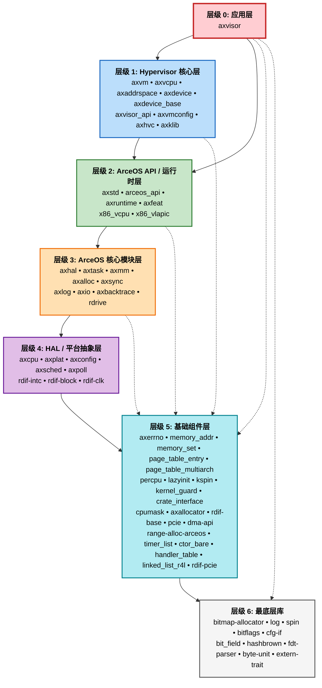
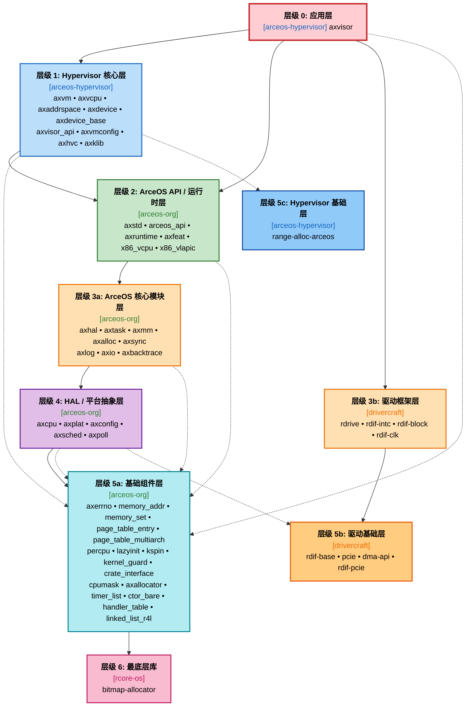

# Axvisor 组件依赖关系与层级图

本文档展示了 `os/axvisor` 的组件依赖关系。

## 1. 完整组件依赖关系图

```mermaid
flowchart TB
    %% 根节点
    axvisor["axvisor<br/>(arceos-hypervisor)"]

    subgraph arceos_hypervisor["arceos-hypervisor 组织"]
        axaddrspace["axaddrspace"]
        axdevice["axdevice"]
        axdevice_base["axdevice_base"]
        axvmconfig["axvmconfig"]
        axvcpu["axvcpu"]
        axvisor_api["axvisor_api"]
        axvm["axvm"]
        x86_vcpu["x86_vcpu"]
        x86_vlapic["x86_vlapic"]
        range_alloc["range-alloc-arceos"]
        axhvc["axhvc"]
        axklib["axklib"]
    end

    subgraph arceos_org["arceos-org 组织"]
        axruntime["axruntime"]
        axstd["axstd"]
        axhal["axhal"]
        axalloc["axalloc"]
        axconfig["axconfig"]
        axtask["axtask"]
        axmm["axmm"]
        axlog["axlog"]
        axsync["axsync"]
        axfeat["axfeat"]
        arceos_api["arceos_api"]
        axio["axio"]
        axcpu["axcpu"]
        axplat["axplat"]
        axsched["axsched"]
        axpoll["axpoll"]
        axbacktrace["axbacktrace"]

        %% 基础库
        axerrno["axerrno"]
        memory_addr["memory_addr"]
        memory_set["memory_set"]
        page_table_entry["page_table_entry"]
        page_table_multiarch["page_table_multiarch"]
        percpu["percpu"]
        lazyinit["lazyinit"]
        kspin["kspin"]
        kernel_guard["kernel_guard"]
        crate_interface["crate_interface"]
        cpumask["cpumask"]
        timer_list["timer_list"]
        ctor_bare["ctor_bare"]
        handler_table["handler_table"]
        linked_list["linked_list_r4l"]

        %% allocator相关
        axallocator["axallocator"]
        bitmap_allocator["bitmap-allocator"]
    end

    subgraph drivercraft["drivercraft 组织"]
        rdrive["rdrive"]
        rdif_block["rdif-block"]
        rdif_clk["rdif-clk"]
        rdif_intc["rdif-intc"]
        rdif_base["rdif-base"]
        rdif_pcie["rdif-pcie"]
        pcie["pcie"]
        dma_api["dma-api"]
    end

    subgraph other["其他外部依赖"]
        log["log"]
        spin["spin"]
        bitflags["bitflags"]
        cfg_if["cfg-if"]
        bit_field["bit_field"]
        hashbrown["hashbrown"]
        fdt_parser["fdt-parser"]
        byte_unit["byte-unit"]
        extern_trait["extern-trait"]
    end

    %% axvisor 直接依赖
    axvisor --> axaddrspace
    axvisor --> axdevice
    axvisor --> axdevice_base
    axvisor --> axerrno
    axvisor --> axhvc
    axvisor --> axklib
    axvisor --> axruntime
    axvisor --> axstd
    axvisor --> axvcpu
    axvisor --> axvisor_api
    axvisor --> axvm
    axvisor --> cpumask
    axvisor --> kernel_guard
    axvisor --> kspin
    axvisor --> lazyinit
    axvisor --> log
    axvisor --> memory_addr
    axvisor --> page_table_entry
    axvisor --> page_table_multiarch
    axvisor --> percpu
    axvisor --> rdif_intc
    axvisor --> rdrive
    axvisor --> spin
    axvisor --> timer_list
    axvisor --> bitflags
    axvisor --> cfg_if
    axvisor --> hashbrown
    axvisor --> fdt_parser
    axvisor --> byte_unit
    axvisor --> extern_trait

    %% arceos-hypervisor 内部依赖
    axaddrspace --> axerrno
    axaddrspace --> lazyinit
    axaddrspace --> memory_addr
    axaddrspace --> memory_set
    axaddrspace --> page_table_entry
    axaddrspace --> page_table_multiarch

    axdevice --> axaddrspace
    axdevice --> axdevice_base
    axdevice --> axerrno
    axdevice --> axvmconfig
    axdevice --> memory_addr
    axdevice --> range_alloc
    axdevice --> spin

    axdevice_base --> axaddrspace
    axdevice_base --> axerrno
    axdevice_base --> axvmconfig
    axdevice_base --> memory_addr

    axvmconfig --> axerrno
    axvmconfig --> log

    axvcpu --> axaddrspace
    axvcpu --> axerrno
    axvcpu --> axvisor_api
    axvcpu --> memory_addr
    axvcpu --> percpu

    axvisor_api --> axaddrspace
    axvisor_api --> crate_interface
    axvisor_api --> memory_addr

    axvm --> axaddrspace
    axvm --> axdevice
    axvm --> axdevice_base
    axvm --> axerrno
    axvm --> axvcpu
    axvm --> axvmconfig
    axvm --> cpumask
    axvm --> memory_addr
    axvm --> page_table_entry
    axvm --> page_table_multiarch
    axvm --> percpu
    axvm --> spin
    axvm --> x86_vcpu

    x86_vcpu --> axaddrspace
    x86_vcpu --> axdevice_base
    x86_vcpu --> axerrno
    x86_vcpu --> axvcpu
    x86_vcpu --> axvisor_api
    x86_vcpu --> page_table_entry
    x86_vcpu --> x86_vlapic

    x86_vlapic --> axaddrspace
    x86_vlapic --> axdevice_base
    x86_vlapic --> axerrno
    x86_vlapic --> axvisor_api
    x86_vlapic --> memory_addr

    axhvc --> axerrno

    axklib --> axerrno
    axklib --> memory_addr

    %% arceos-org 依赖关系
    axruntime --> axalloc
    axruntime --> axbacktrace
    axruntime --> axconfig
    axruntime --> axerrno
    axruntime --> axhal
    axruntime --> axlog
    axruntime --> axmm
    axruntime --> axplat
    axruntime --> axtask
    axruntime --> chrono
    axruntime --> crate_interface
    axruntime --> ctor_bare
    axruntime --> log
    axruntime --> percpu

    axstd --> arceos_api
    axstd --> axerrno
    axstd --> axfeat
    axstd --> axio
    axstd --> kspin
    axstd --> lazyinit
    axstd --> lock_api

    arceos_api --> axalloc
    arceos_api --> axconfig
    arceos_api --> axerrno
    arceos_api --> axfeat
    arceos_api --> axhal
    arceos_api --> axlog
    arceos_api --> axruntime
    arceos_api --> axsync
    arceos_api --> axtask

    axfeat --> axalloc
    axfeat --> axbacktrace
    axfeat --> axhal
    axfeat --> axlog
    axfeat --> axruntime
    axfeat --> axsync
    axfeat --> axtask
    axfeat --> kspin

    axhal --> axalloc
    axhal --> axconfig
    axhal --> axcpu
    axhal --> axplat
    axhal --> fdt_parser
    axhal --> heapless
    axhal --> kernel_guard
    axhal --> lazyinit
    axhal --> linkme
    axhal --> log
    axhal --> memory_addr
    axhal --> page_table_multiarch
    axhal --> percpu

    axcpu --> axbacktrace
    axcpu --> lazyinit
    axcpu --> linkme
    axcpu --> log
    axcpu --> memory_addr
    axcpu --> page_table_entry
    axcpu --> percpu
    axcpu --> static_assertions

    axplat --> axplat_macros
    axplat --> bitflags
    axplat --> const_str
    axplat --> crate_interface
    axplat --> handler_table
    axplat --> kspin
    axplat --> memory_addr
    axplat --> percpu

    axalloc --> axallocator
    axalloc --> axerrno
    axalloc --> cfg_if
    axalloc --> kspin
    axalloc --> log
    axalloc --> memory_addr
    axalloc --> strum

    axallocator --> axerrno
    axallocator --> bitmap_allocator
    axallocator --> cfg_if
    axallocator --> rlsf

    bitmap_allocator --> bit_field

    axtask --> axconfig
    axtask --> axerrno
    axtask --> axhal
    axtask --> axpoll
    axtask --> axsched
    axtask --> cpumask
    axtask --> crate_interface
    axtask --> event_listener
    axtask --> extern_trait
    axtask --> futures_util
    axtask --> kernel_guard
    axtask --> kspin
    axtask --> lazyinit
    axtask --> log
    axtask --> memory_addr
    axtask --> percpu

    axsched --> linked_list

    axmm --> axalloc
    axmm --> axconfig
    axmm --> axerrno
    axmm --> axhal
    axmm --> kspin
    axmm --> lazyinit
    axmm --> log
    axmm --> memory_addr
    axmm --> memory_set

    axsync --> axtask
    axsync --> event_listener
    axsync --> kspin
    axsync --> lock_api

    axio --> axerrno
    axio --> heapless
    axio --> memchr

    axlog --> crate_interface
    axlog --> kspin
    axlog --> log

    axconfig --> axconfig_macros

    axconfig_macros --> axconfig_gen

    %% drivercraft 依赖关系
    rdrive --> fdt_parser
    rdrive --> log
    rdrive --> pcie
    rdrive --> rdif_base
    rdrive --> rdif_pcie
    rdrive --> spin

    rdif_block --> cfg_if
    rdif_block --> dma_api
    rdif_block --> futures
    rdif_block --> rdif_base
    rdif_block --> spin_on
    rdif_block --> thiserror

    rdif_clk --> rdif_base

    rdif_intc --> cfg_if
    rdif_intc --> rdif_base
    rdif_intc --> thiserror

    rdif_base --> as_any
    rdif_base --> async_trait
    rdif_base --> paste
    rdif_base --> rdif_def
    rdif_base --> thiserror

    pcie --> bit_field
    pcie --> bitflags
    pcie --> log
    pcie --> pci_types
    pcie --> rdif_pcie
    pcie --> thiserror

    rdif_pcie --> pci_types
    rdif_pcie --> rdif_base
    rdif_pcie --> thiserror

    dma_api --> cfg_if
    dma_api --> spin
    dma_api --> thiserror

    %% 基础库依赖
    memory_set --> axerrno
    memory_set --> memory_addr

    page_table_entry --> bitflags
    page_table_entry --> memory_addr
    page_table_entry --> x86_64

    page_table_multiarch --> log
    page_table_multiarch --> memory_addr
    page_table_multiarch --> page_table_entry
    page_table_multiarch --> x86

    percpu --> cfg_if
    percpu --> percpu_macros
    percpu --> spin
    percpu --> x86

    kspin --> cfg_if
    kspin --> kernel_guard

    kernel_guard --> cfg_if
    kernel_guard --> crate_interface

    cpumask --> bitmaps

    %% 样式设置
    classDef hypervisor fill:#e1f5fe,stroke:#01579b,stroke-width:2px
    classDef arceos fill:#e8f5e9,stroke:#2e7d32,stroke-width:2px
    classDef driver fill:#fff3e0,stroke:#ef6c00,stroke-width:2px
    classDef external fill:#f5f5f5,stroke:#616161,stroke-width:1px

    class axaddrspace,axdevice,axdevice_base,axvmconfig,axvcpu,axvisor_api,axvm,x86_vcpu,x86_vlapic,range_alloc,axhvc,axklib hypervisor
    class axruntime,axstd,axhal,axalloc,axconfig,axtask,axmm,axlog,axsync,axfeat,arceos_api,axio,axcpu,axplat,axsched,axpoll,axbacktrace,axerrno,memory_addr,memory_set,page_table_entry,page_table_multiarch,percpu,lazyinit,kspin,kernel_guard,crate_interface,cpumask,timer_list,ctor_bare,handler_table,linked_list,axallocator,bitmap_allocator arceos
    class rdrive,rdif_block,rdif_clk,rdif_intc,rdif_base,rdif_pcie,pcie,dma_api driver
    class log,spin,bitflags,cfg_if,bit_field,hashbrown,fdt_parser,byte_unit,extern_trait external
```

## 2. 四大组织组件依赖关系图

只包含 **arceos-hypervisor**、**arceos-org**、**rcore-os**、**drivercraft** 四个组织的组件：

```mermaid
flowchart TB
    %% 根节点
    axvisor["axvisor<br/>(arceos-hypervisor)"]

    subgraph arceos_hypervisor["arceos-hypervisor 组织"]
        axaddrspace["axaddrspace"]
        axdevice["axdevice"]
        axdevice_base["axdevice_base"]
        axvmconfig["axvmconfig"]
        axvcpu["axvcpu"]
        axvisor_api["axvisor_api"]
        axvm["axvm"]
        x86_vcpu["x86_vcpu"]
        x86_vlapic["x86_vlapic"]
        range_alloc["range-alloc-arceos"]
        axhvc["axhvc"]
        axklib["axklib"]
    end

    subgraph arceos_org["arceos-org 组织"]
        axruntime["axruntime"]
        axstd["axstd"]
        axhal["axhal"]
        axalloc["axalloc"]
        axconfig["axconfig"]
        axtask["axtask"]
        axmm["axmm"]
        axlog["axlog"]
        axsync["axsync"]
        axfeat["axfeat"]
        arceos_api["arceos_api"]
        axio["axio"]
        axcpu["axcpu"]
        axplat["axplat"]
        axsched["axsched"]
        axpoll["axpoll"]
        axbacktrace["axbacktrace"]

        %% 基础库
        axerrno["axerrno"]
        memory_addr["memory_addr"]
        memory_set["memory_set"]
        page_table_entry["page_table_entry"]
        page_table_multiarch["page_table_multiarch"]
        percpu["percpu"]
        lazyinit["lazyinit"]
        kspin["kspin"]
        kernel_guard["kernel_guard"]
        crate_interface["crate_interface"]
        cpumask["cpumask"]
        timer_list["timer_list"]
        ctor_bare["ctor_bare"]
        handler_table["handler_table"]
        linked_list["linked_list_r4l"]

        %% allocator相关
        axallocator["axallocator"]
        bitmap_allocator["bitmap-allocator<br/>(rcore-os)"]
    end

    subgraph drivercraft["drivercraft 组织"]
        rdrive["rdrive"]
        rdif_block["rdif-block"]
        rdif_clk["rdif-clk"]
        rdif_intc["rdif-intc"]
        rdif_base["rdif-base"]
        rdif_pcie["rdif-pcie"]
        pcie["pcie"]
        dma_api["dma-api"]
    end

    %% axvisor 直接依赖
    axvisor --> axaddrspace
    axvisor --> axdevice
    axvisor --> axdevice_base
    axvisor --> axerrno
    axvisor --> axhvc
    axvisor --> axklib
    axvisor --> axruntime
    axvisor --> axstd
    axvisor --> axvcpu
    axvisor --> axvisor_api
    axvisor --> axvm
    axvisor --> cpumask
    axvisor --> kernel_guard
    axvisor --> kspin
    axvisor --> lazyinit
    axvisor --> memory_addr
    axvisor --> page_table_entry
    axvisor --> page_table_multiarch
    axvisor --> percpu
    axvisor --> rdif_intc
    axvisor --> rdrive
    axvisor --> timer_list

    %% arceos-hypervisor 内部依赖
    axaddrspace --> axerrno
    axaddrspace --> lazyinit
    axaddrspace --> memory_addr
    axaddrspace --> memory_set
    axaddrspace --> page_table_entry
    axaddrspace --> page_table_multiarch

    axdevice --> axaddrspace
    axdevice --> axdevice_base
    axdevice --> axerrno
    axdevice --> axvmconfig
    axdevice --> memory_addr
    axdevice --> range_alloc

    axdevice_base --> axaddrspace
    axdevice_base --> axerrno
    axdevice_base --> axvmconfig
    axdevice_base --> memory_addr

    axvmconfig --> axerrno

    axvcpu --> axaddrspace
    axvcpu --> axerrno
    axvcpu --> axvisor_api
    axvcpu --> memory_addr
    axvcpu --> percpu

    axvisor_api --> axaddrspace
    axvisor_api --> crate_interface
    axvisor_api --> memory_addr

    axvm --> axaddrspace
    axvm --> axdevice
    axvm --> axdevice_base
    axvm --> axerrno
    axvm --> axvcpu
    axvm --> axvmconfig
    axvm --> cpumask
    axvm --> memory_addr
    axvm --> page_table_entry
    axvm --> page_table_multiarch
    axvm --> percpu
    axvm --> x86_vcpu

    x86_vcpu --> axaddrspace
    x86_vcpu --> axdevice_base
    x86_vcpu --> axerrno
    x86_vcpu --> axvcpu
    x86_vcpu --> axvisor_api
    x86_vcpu --> page_table_entry
    x86_vcpu --> x86_vlapic

    x86_vlapic --> axaddrspace
    x86_vlapic --> axdevice_base
    x86_vlapic --> axerrno
    x86_vlapic --> axvisor_api
    x86_vlapic --> memory_addr

    axhvc --> axerrno

    axklib --> axerrno
    axklib --> memory_addr

    %% arceos-org 依赖关系
    axruntime --> axalloc
    axruntime --> axbacktrace
    axruntime --> axconfig
    axruntime --> axerrno
    axruntime --> axhal
    axruntime --> axlog
    axruntime --> axmm
    axruntime --> axplat
    axruntime --> axtask
    axruntime --> crate_interface
    axruntime --> ctor_bare
    axruntime --> percpu

    axstd --> arceos_api
    axstd --> axerrno
    axstd --> axfeat
    axstd --> axio
    axstd --> kspin
    axstd --> lazyinit

    arceos_api --> axalloc
    arceos_api --> axconfig
    arceos_api --> axerrno
    arceos_api --> axfeat
    arceos_api --> axhal
    arceos_api --> axlog
    arceos_api --> axruntime
    arceos_api --> axsync
    arceos_api --> axtask

    axfeat --> axalloc
    axfeat --> axbacktrace
    axfeat --> axhal
    axfeat --> axlog
    axfeat --> axruntime
    axfeat --> axsync
    axfeat --> axtask
    axfeat --> kspin

    axhal --> axalloc
    axhal --> axconfig
    axhal --> axcpu
    axhal --> axplat
    axhal --> kernel_guard
    axhal --> lazyinit
    axhal --> memory_addr
    axhal --> page_table_multiarch
    axhal --> percpu

    axcpu --> axbacktrace
    axcpu --> lazyinit
    axcpu --> memory_addr
    axcpu --> page_table_entry
    axcpu --> percpu

    axplat --> crate_interface
    axplat --> handler_table
    axplat --> kspin
    axplat --> memory_addr
    axplat --> percpu

    axalloc --> axallocator
    axalloc --> axerrno
    axalloc --> kspin
    axalloc --> memory_addr

    axallocator --> axerrno
    axallocator --> bitmap_allocator

    axtask --> axconfig
    axtask --> axerrno
    axtask --> axhal
    axtask --> axpoll
    axtask --> axsched
    axtask --> cpumask
    axtask --> crate_interface
    axtask --> kernel_guard
    axtask --> kspin
    axtask --> lazyinit
    axtask --> memory_addr
    axtask --> percpu

    axsched --> linked_list

    axmm --> axalloc
    axmm --> axconfig
    axmm --> axerrno
    axmm --> axhal
    axmm --> kspin
    axmm --> lazyinit
    axmm --> memory_addr
    axmm --> memory_set

    axsync --> axtask
    axsync --> kspin

    axio --> axerrno

    axlog --> crate_interface
    axlog --> kspin

    axconfig --> axconfig_macros

    %% drivercraft 依赖关系
    rdrive --> pcie
    rdrive --> rdif_base
    rdrive --> rdif_pcie

    rdif_block --> dma_api
    rdif_block --> rdif_base

    rdif_clk --> rdif_base

    rdif_intc --> rdif_base

    rdif_base --> rdif_def

    pcie --> pci_types
    pcie --> rdif_pcie

    rdif_pcie --> rdif_base

    %% 基础库依赖
    memory_set --> axerrno
    memory_set --> memory_addr

    page_table_multiarch --> memory_addr
    page_table_multiarch --> page_table_entry

    percpu --> kspin

    kspin --> kernel_guard

    kernel_guard --> crate_interface

    %% 样式设置
    classDef hypervisor fill:#e1f5fe,stroke:#01579b,stroke-width:2px
    classDef arceos fill:#e8f5e9,stroke:#2e7d32,stroke-width:2px
    classDef driver fill:#fff3e0,stroke:#ef6c00,stroke-width:2px
    classDef rcore fill:#fce4ec,stroke:#c2185b,stroke-width:2px

    class axaddrspace,axdevice,axdevice_base,axvmconfig,axvcpu,axvisor_api,axvm,x86_vcpu,x86_vlapic,range_alloc,axhvc,axklib hypervisor
    class axruntime,axstd,axhal,axalloc,axconfig,axtask,axmm,axlog,axsync,axfeat,arceos_api,axio,axcpu,axplat,axsched,axpoll,axbacktrace,axerrno,memory_addr,memory_set,page_table_entry,page_table_multiarch,percpu,lazyinit,kspin,kernel_guard,crate_interface,cpumask,timer_list,ctor_bare,handler_table,linked_list,axallocator arceos
    class rdrive,rdif_block,rdif_clk,rdif_intc,rdif_base,rdif_pcie,pcie,dma_api driver
    class bitmap_allocator rcore
```

---

## 3. 完整组件层级图

### 完整组件层级列表

| 层级 | 名称 | 数量 | 组件列表 |
|------|------|------|----------|
| **0** | 应用层 | 1 | `axvisor` |
| **1** | Hypervisor 核心层 | 9 | `axvm` `axvcpu` `axaddrspace` `axdevice` `axdevice_base` `axvisor_api` `axvmconfig` `axhvc` `axklib` |
| **2** | ArceOS API / 运行时层 | 6 | `axstd` `arceos_api` `axruntime` `axfeat` `x86_vcpu` `x86_vlapic` |
| **3** | ArceOS 核心模块层 | 9 | `axhal` `axtask` `axmm` `axalloc` `axsync` `axlog` `axio` `axbacktrace` `rdrive` |
| **4** | HAL / 平台抽象层 | 8 | `axcpu` `axplat` `axconfig` `axsched` `axpoll` `rdif-intc` `rdif-block` `rdif-clk` |
| **5** | 基础组件层 | 21 | `axerrno` `memory_addr` `memory_set` `page_table_entry` `page_table_multiarch` `percpu` `lazyinit` `kspin` `kernel_guard` `crate_interface` `cpumask` `axallocator` `rdif-base` `pcie` `dma-api` `range-alloc-arceos` `timer_list` `ctor_bare` `handler_table` `linked_list_r4l` `rdif-pcie` |
| **6** | 最底层库 | 10 | `bitmap-allocator` `log` `spin` `bitflags` `cfg-if` `bit_field` `hashbrown` `fdt-parser` `byte-unit` `extern-trait` |
| | **总计** | **64** | |

## 4 四大组织组件层级图

### 四大组织组件层级列表

| 层级 | 组织 | 数量 | 组件列表 |
|------|------|------|----------|
| **0** | arceos-hypervisor | 1 | `axvisor` |
| **1** | arceos-hypervisor | 9 | `axvm` `axvcpu` `axaddrspace` `axdevice` `axdevice_base` `axvisor_api` `axvmconfig` `axhvc` `axklib` |
| **2** | arceos-org | 6 | `axstd` `arceos_api` `axruntime` `axfeat` `x86_vcpu` `x86_vlapic` |
| **3a** | arceos-org | 8 | `axhal` `axtask` `axmm` `axalloc` `axsync` `axlog` `axio` `axbacktrace` |
| **3b** | drivercraft | 4 | `rdrive` `rdif-intc` `rdif-block` `rdif-clk` |
| **4** | arceos-org | 5 | `axcpu` `axplat` `axconfig` `axsched` `axpoll` |
| **5a** | arceos-org | 16 | `axerrno` `memory_addr` `memory_set` `page_table_entry` `page_table_multiarch` `percpu` `lazyinit` `kspin` `kernel_guard` `crate_interface` `cpumask` `axallocator` `timer_list` `ctor_bare` `handler_table` `linked_list_r4l` |
| **5b** | drivercraft | 4 | `rdif-base` `pcie` `dma-api` `rdif-pcie` |
| **5c** | arceos-hypervisor | 1 | `range-alloc-arceos` |
| **6** | rcore-os | 1 | `bitmap-allocator` |
| | **总计** | **51** | |
