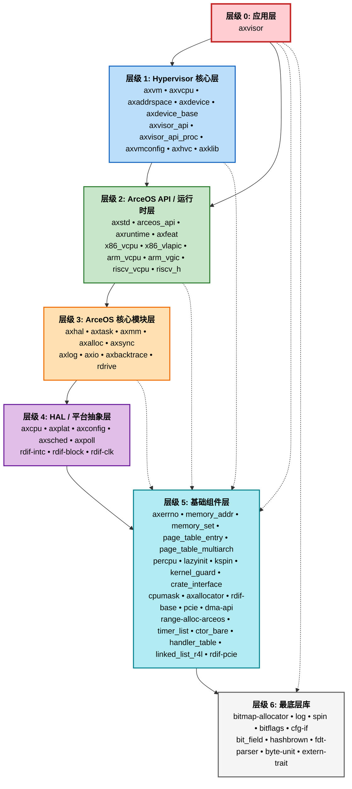
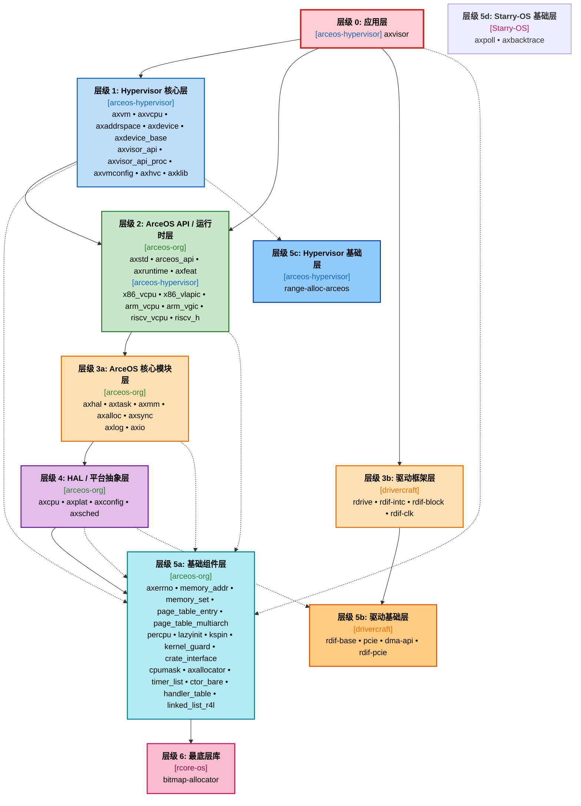

```mermaid
flowchart TB
    axvisor["axvisor<br/>(arceos-hypervisor)"]

    subgraph arceos_hypervisor["arceos-hypervisor 组织"]
        arm_vcpu["arm-vcpu"]
        arm_vgic["arm-vgic"]
        axaddrspace["axaddrspace"]
        axdevice["axdevice"]
        axdevice_base["axdevice-base"]
        axhvc["axhvc"]
        axklib["axklib"]
        axplat_dyn["axplat-dyn"]
        axvcpu["axvcpu"]
        axvisor_api["axvisor-api"]
        axvisor_api_proc["axvisor-api-proc"]
        axvm["axvm"]
        axvmconfig["axvmconfig"]
        range_alloc_arceos["range-alloc-arceos"]
        riscv_h["riscv-h"]
        riscv_vcpu["riscv-vcpu"]
        riscv_vplic["riscv-vplic"]
        x86_vcpu["x86-vcpu"]
        x86_vlapic["x86-vlapic"]
    end

    subgraph arceos_org["arceos-org 组织"]
        arceos_api["arceos-api"]
        axalloc["axalloc"]
        axallocator["axallocator"]
        axconfig["axconfig"]
        axconfig_gen["axconfig-gen"]
        axconfig_macros["axconfig-macros"]
        axcpu["axcpu"]
        axerrno["axerrno"]
        axfeat["axfeat"]
        axhal["axhal"]
        axio["axio"]
        axlog["axlog"]
        axmm["axmm"]
        axplat["axplat"]
        axplat_macros["axplat-macros"]
        axruntime["axruntime"]
        axsched["axsched"]
        axstd["axstd"]
        axsync["axsync"]
        axtask["axtask"]
        cpumask["cpumask"]
        crate_interface["crate-interface"]
        ctor_bare["ctor-bare"]
        ctor_bare_macros["ctor-bare-macros"]
        handler_table["handler-table"]
        kernel_guard["kernel-guard"]
        kspin["kspin"]
        lazyinit["lazyinit"]
        linked_list_r4l["linked-list-r4l"]
        memory_addr["memory-addr"]
        memory_set["memory-set"]
        page_table_entry["page-table-entry"]
        page_table_multiarch["page-table-multiarch"]
        percpu["percpu"]
        percpu_macros["percpu-macros"]
        timer_list["timer-list"]
    end

    subgraph starry_os["starry-os 组织"]
        axbacktrace["axbacktrace"]
        axpoll["axpoll"]
    end

    subgraph rcore_os["rcore-os 组织"]
        any_uart["any-uart"]
        arm_gic_driver["arm-gic-driver"]
        bindeps_simple["bindeps-simple"]
        bitmap_allocator["bitmap-allocator"]
        kasm_aarch64["kasm-aarch64"]
        kdef_pgtable["kdef-pgtable"]
        num_align["num-align"]
        page_table_generic["page-table-generic"]
        pie_boot_if["pie-boot-if"]
        pie_boot_loader_aarch64["pie-boot-loader-aarch64"]
        pie_boot_macros["pie-boot-macros"]
        somehal["somehal"]
    end

    subgraph drivercraft["drivercraft 组织"]
        aarch64_cpu_ext["aarch64-cpu-ext"]
        dma_api["dma-api"]
        pci_types["pci-types"]
        pcie["pcie"]
        rdif_base["rdif-base"]
        rdif_block["rdif-block"]
        rdif_clk["rdif-clk"]
        rdif_def["rdif-def"]
        rdif_intc["rdif-intc"]
        rdif_pcie["rdif-pcie"]
        rdrive["rdrive"]
        rdrive_macros["rdrive-macros"]
        release_dep["release-dep"]
    end

    arceos_api --> axalloc
    arceos_api --> axconfig
    arceos_api --> axerrno
    arceos_api --> axfeat
    arceos_api --> axhal
    arceos_api --> axio
    arceos_api --> axlog
    arceos_api --> axruntime
    arceos_api --> axsync
    arceos_api --> axtask
    arm_gic_driver --> rdif_intc
    arm_vcpu --> axaddrspace
    arm_vcpu --> axdevice_base
    arm_vcpu --> axerrno
    arm_vcpu --> axvcpu
    arm_vcpu --> axvisor_api
    arm_vcpu --> percpu
    arm_vgic --> axaddrspace
    arm_vgic --> axdevice_base
    arm_vgic --> axerrno
    arm_vgic --> axvisor_api
    arm_vgic --> memory_addr
    axaddrspace --> axerrno
    axaddrspace --> lazyinit
    axaddrspace --> memory_addr
    axaddrspace --> memory_set
    axaddrspace --> page_table_entry
    axaddrspace --> page_table_multiarch
    axalloc --> axallocator
    axalloc --> axerrno
    axalloc --> kspin
    axalloc --> memory_addr
    axallocator --> axerrno
    axallocator --> bitmap_allocator
    axconfig --> axconfig_macros
    axconfig_macros --> axconfig_gen
    axcpu --> axbacktrace
    axcpu --> lazyinit
    axcpu --> memory_addr
    axcpu --> page_table_entry
    axcpu --> page_table_multiarch
    axcpu --> percpu
    axdevice --> arm_vgic
    axdevice --> axaddrspace
    axdevice --> axdevice_base
    axdevice --> axerrno
    axdevice --> axvmconfig
    axdevice --> memory_addr
    axdevice --> range_alloc_arceos
    axdevice --> riscv_vplic
    axdevice_base --> axaddrspace
    axdevice_base --> axerrno
    axdevice_base --> axvmconfig
    axdevice_base --> memory_addr
    axfeat --> axalloc
    axfeat --> axbacktrace
    axfeat --> axhal
    axfeat --> axlog
    axfeat --> axruntime
    axfeat --> axsync
    axfeat --> axtask
    axfeat --> kspin
    axhal --> axalloc
    axhal --> axconfig
    axhal --> axcpu
    axhal --> axplat
    axhal --> kernel_guard
    axhal --> lazyinit
    axhal --> memory_addr
    axhal --> page_table_multiarch
    axhal --> percpu
    axhvc --> axerrno
    axio --> axerrno
    axklib --> axerrno
    axklib --> memory_addr
    axlog --> crate_interface
    axlog --> kspin
    axmm --> axalloc
    axmm --> axconfig
    axmm --> axerrno
    axmm --> axhal
    axmm --> kspin
    axmm --> lazyinit
    axmm --> memory_addr
    axmm --> memory_set
    axplat --> axplat_macros
    axplat --> crate_interface
    axplat --> handler_table
    axplat --> kspin
    axplat --> memory_addr
    axplat --> percpu
    axplat_dyn --> aarch64_cpu_ext
    axplat_dyn --> any_uart
    axplat_dyn --> arm_gic_driver
    axplat_dyn --> axconfig_macros
    axplat_dyn --> axcpu
    axplat_dyn --> axplat
    axplat_dyn --> lazyinit
    axplat_dyn --> memory_addr
    axplat_dyn --> page_table_entry
    axplat_dyn --> percpu
    axplat_dyn --> rdif_intc
    axplat_dyn --> rdrive
    axplat_dyn --> somehal
    axruntime --> axalloc
    axruntime --> axbacktrace
    axruntime --> axconfig
    axruntime --> axerrno
    axruntime --> axhal
    axruntime --> axlog
    axruntime --> axmm
    axruntime --> axplat
    axruntime --> axplat_dyn
    axruntime --> axtask
    axruntime --> crate_interface
    axruntime --> ctor_bare
    axruntime --> percpu
    axruntime --> somehal
    axsched --> linked_list_r4l
    axstd --> arceos_api
    axstd --> axerrno
    axstd --> axfeat
    axstd --> axio
    axstd --> kspin
    axstd --> lazyinit
    axsync --> axtask
    axsync --> kspin
    axtask --> axconfig
    axtask --> axerrno
    axtask --> axhal
    axtask --> axpoll
    axtask --> axsched
    axtask --> cpumask
    axtask --> crate_interface
    axtask --> kernel_guard
    axtask --> kspin
    axtask --> lazyinit
    axtask --> memory_addr
    axtask --> percpu
    axvcpu --> axaddrspace
    axvcpu --> axerrno
    axvcpu --> axvisor_api
    axvcpu --> memory_addr
    axvcpu --> percpu
    axvisor --> aarch64_cpu_ext
    axvisor --> arm_gic_driver
    axvisor --> axaddrspace
    axvisor --> axconfig
    axvisor --> axdevice
    axvisor --> axdevice_base
    axvisor --> axerrno
    axvisor --> axhvc
    axvisor --> axklib
    axvisor --> axruntime
    axvisor --> axstd
    axvisor --> axvcpu
    axvisor --> axvisor_api
    axvisor --> axvm
    axvisor --> cpumask
    axvisor --> crate_interface
    axvisor --> kernel_guard
    axvisor --> kspin
    axvisor --> lazyinit
    axvisor --> memory_addr
    axvisor --> page_table_entry
    axvisor --> page_table_multiarch
    axvisor --> percpu
    axvisor --> rdif_block
    axvisor --> rdif_clk
    axvisor --> rdif_intc
    axvisor --> rdrive
    axvisor --> timer_list
    axvisor_api --> axaddrspace
    axvisor_api --> axvisor_api_proc
    axvisor_api --> crate_interface
    axvisor_api --> memory_addr
    axvm --> arm_vcpu
    axvm --> arm_vgic
    axvm --> axaddrspace
    axvm --> axdevice
    axvm --> axdevice_base
    axvm --> axerrno
    axvm --> axvcpu
    axvm --> axvmconfig
    axvm --> cpumask
    axvm --> memory_addr
    axvm --> page_table_entry
    axvm --> page_table_multiarch
    axvm --> percpu
    axvm --> riscv_vcpu
    axvm --> x86_vcpu
    axvmconfig --> axerrno
    ctor_bare --> ctor_bare_macros
    dma_api --> aarch64_cpu_ext
    kernel_guard --> crate_interface
    kspin --> kernel_guard
    memory_set --> axerrno
    memory_set --> memory_addr
    page_table_entry --> memory_addr
    page_table_generic --> num_align
    page_table_multiarch --> memory_addr
    page_table_multiarch --> page_table_entry
    pcie --> pci_types
    pcie --> rdif_pcie
    percpu --> percpu_macros
    pie_boot_loader_aarch64 --> aarch64_cpu_ext
    pie_boot_loader_aarch64 --> any_uart
    pie_boot_loader_aarch64 --> kasm_aarch64
    pie_boot_loader_aarch64 --> kdef_pgtable
    pie_boot_loader_aarch64 --> num_align
    pie_boot_loader_aarch64 --> page_table_generic
    pie_boot_loader_aarch64 --> pie_boot_if
    rdif_base --> rdif_def
    rdif_block --> dma_api
    rdif_block --> rdif_base
    rdif_clk --> rdif_base
    rdif_intc --> rdif_base
    rdif_pcie --> pci_types
    rdif_pcie --> rdif_base
    rdrive --> pcie
    rdrive --> rdif_base
    rdrive --> rdif_pcie
    rdrive --> rdrive_macros
    riscv_vcpu --> axaddrspace
    riscv_vcpu --> axerrno
    riscv_vcpu --> axvcpu
    riscv_vcpu --> axvisor_api
    riscv_vcpu --> crate_interface
    riscv_vcpu --> memory_addr
    riscv_vcpu --> page_table_entry
    riscv_vcpu --> riscv_h
    riscv_vplic --> axaddrspace
    riscv_vplic --> axdevice_base
    riscv_vplic --> axerrno
    riscv_vplic --> axvisor_api
    riscv_vplic --> riscv_h
    somehal --> aarch64_cpu_ext
    somehal --> any_uart
    somehal --> bindeps_simple
    somehal --> kasm_aarch64
    somehal --> kdef_pgtable
    somehal --> num_align
    somehal --> page_table_generic
    somehal --> pie_boot_if
    somehal --> pie_boot_loader_aarch64
    somehal --> pie_boot_macros
    somehal --> release_dep
    x86_vcpu --> axaddrspace
    x86_vcpu --> axdevice_base
    x86_vcpu --> axerrno
    x86_vcpu --> axvcpu
    x86_vcpu --> axvisor_api
    x86_vcpu --> crate_interface
    x86_vcpu --> memory_addr
    x86_vcpu --> page_table_entry
    x86_vcpu --> x86_vlapic
    x86_vlapic --> axaddrspace
    x86_vlapic --> axdevice_base
    x86_vlapic --> axerrno
    x86_vlapic --> axvisor_api
    x86_vlapic --> memory_addr

    classDef hypervisor fill:#e1f5fe,stroke:#01579b,stroke-width:2px
    classDef arceos fill:#e8f5e9,stroke:#2e7d32,stroke-width:2px
    classDef starry fill:#fce4ec,stroke:#c2185b,stroke-width:2px
    classDef driver fill:#fff3e0,stroke:#ef6c00,stroke-width:2px
    classDef rcore fill:#f3e5f1,stroke:#880e4f,stroke-width:2px
    classDef external fill:#f5f5f5,stroke:#616161,stroke-width:1px

    class arm_vcpu hypervisor
    class arm_vgic hypervisor
    class axaddrspace hypervisor
    class axdevice hypervisor
    class axdevice_base hypervisor
    class axhvc hypervisor
    class axklib hypervisor
    class axplat_dyn hypervisor
    class axvcpu hypervisor
    class axvisor hypervisor
    class axvisor_api hypervisor
    class axvisor_api_proc hypervisor
    class axvm hypervisor
    class axvmconfig hypervisor
    class range_alloc_arceos hypervisor
    class riscv_h hypervisor
    class riscv_vcpu hypervisor
    class riscv_vplic hypervisor
    class x86_vcpu hypervisor
    class x86_vlapic hypervisor
    class arceos_api arceos
    class axalloc arceos
    class axallocator arceos
    class axconfig arceos
    class axconfig_gen arceos
    class axconfig_macros arceos
    class axcpu arceos
    class axerrno arceos
    class axfeat arceos
    class axhal arceos
    class axio arceos
    class axlog arceos
    class axmm arceos
    class axplat arceos
    class axplat_macros arceos
    class axruntime arceos
    class axsched arceos
    class axstd arceos
    class axsync arceos
    class axtask arceos
    class cpumask arceos
    class crate_interface arceos
    class ctor_bare arceos
    class ctor_bare_macros arceos
    class handler_table arceos
    class kernel_guard arceos
    class kspin arceos
    class lazyinit arceos
    class linked_list_r4l arceos
    class memory_addr arceos
    class memory_set arceos
    class page_table_entry arceos
    class page_table_multiarch arceos
    class percpu arceos
    class percpu_macros arceos
    class timer_list arceos
    class axbacktrace starry
    class axpoll starry
    class aarch64_cpu_ext driver
    class dma_api driver
    class pci_types driver
    class pcie driver
    class rdif_base driver
    class rdif_block driver
    class rdif_clk driver
    class rdif_def driver
    class rdif_intc driver
    class rdif_pcie driver
    class rdrive driver
    class rdrive_macros driver
    class release_dep driver
    class any_uart rcore
    class arm_gic_driver rcore
    class bindeps_simple rcore
    class bitmap_allocator rcore
    class kasm_aarch64 rcore
    class kdef_pgtable rcore
    class num_align rcore
    class page_table_generic rcore
    class pie_boot_if rcore
    class pie_boot_loader_aarch64 rcore
    class pie_boot_macros rcore
    class somehal rcore
```

# Axvisor 组件依赖关系与层级图
本文档展示了 `os/axvisor` 在四个架构上的完整组件依赖关系。

**分析架构**: riscv64gc-unknown-none-elf, x86_64-unknown-none, aarch64-unknown-none-softfloat, loongarch64-unknown-none

## 1. 完整组件依赖关系图

```mermaid
flowchart TB
    axvisor["axvisor<br/>(arceos-hypervisor)"]

    subgraph arceos_hypervisor["arceos-hypervisor 组织"]
        arm_vcpu["arm-vcpu"]
        arm_vgic["arm-vgic"]
        axaddrspace["axaddrspace"]
        axdevice["axdevice"]
        axdevice_base["axdevice-base"]
        axhvc["axhvc"]
        axklib["axklib"]
        axplat_dyn["axplat-dyn"]
        axvcpu["axvcpu"]
        axvisor_api["axvisor-api"]
        axvisor_api_proc["axvisor-api-proc"]
        axvm["axvm"]
        axvmconfig["axvmconfig"]
        range_alloc_arceos["range-alloc-arceos"]
        riscv_h["riscv-h"]
        riscv_vcpu["riscv-vcpu"]
        riscv_vplic["riscv-vplic"]
        x86_vcpu["x86-vcpu"]
        x86_vlapic["x86-vlapic"]
    end

    subgraph arceos_org["arceos-org 组织"]
        arceos_api["arceos-api"]
        axalloc["axalloc"]
        axallocator["axallocator"]
        axconfig["axconfig"]
        axconfig_gen["axconfig-gen"]
        axconfig_macros["axconfig-macros"]
        axcpu["axcpu"]
        axerrno["axerrno"]
        axfeat["axfeat"]
        axhal["axhal"]
        axio["axio"]
        axlog["axlog"]
        axmm["axmm"]
        axplat["axplat"]
        axplat_macros["axplat-macros"]
        axruntime["axruntime"]
        axsched["axsched"]
        axstd["axstd"]
        axsync["axsync"]
        axtask["axtask"]
        cpumask["cpumask"]
        crate_interface["crate-interface"]
        ctor_bare["ctor-bare"]
        ctor_bare_macros["ctor-bare-macros"]
        handler_table["handler-table"]
        kernel_guard["kernel-guard"]
        kspin["kspin"]
        lazyinit["lazyinit"]
        linked_list_r4l["linked-list-r4l"]
        memory_addr["memory-addr"]
        memory_set["memory-set"]
        page_table_entry["page-table-entry"]
        page_table_multiarch["page-table-multiarch"]
        percpu["percpu"]
        percpu_macros["percpu-macros"]
        timer_list["timer-list"]
    end

    subgraph starry_os["starry-os 组织"]
        axbacktrace["axbacktrace"]
        axpoll["axpoll"]
    end

    subgraph rcore_os["rcore-os 组织"]
        any_uart["any-uart"]
        arm_gic_driver["arm-gic-driver"]
        bindeps_simple["bindeps-simple"]
        bitmap_allocator["bitmap-allocator"]
        kasm_aarch64["kasm-aarch64"]
        kdef_pgtable["kdef-pgtable"]
        num_align["num-align"]
        page_table_generic["page-table-generic"]
        pie_boot_if["pie-boot-if"]
        pie_boot_loader_aarch64["pie-boot-loader-aarch64"]
        pie_boot_macros["pie-boot-macros"]
        somehal["somehal"]
    end

    subgraph drivercraft["drivercraft 组织"]
        aarch64_cpu_ext["aarch64-cpu-ext"]
        dma_api["dma-api"]
        pci_types["pci-types"]
        pcie["pcie"]
        rdif_base["rdif-base"]
        rdif_block["rdif-block"]
        rdif_clk["rdif-clk"]
        rdif_def["rdif-def"]
        rdif_intc["rdif-intc"]
        rdif_pcie["rdif-pcie"]
        rdrive["rdrive"]
        rdrive_macros["rdrive-macros"]
        release_dep["release-dep"]
    end

    subgraph other["其他外部依赖"]
        log["log"]
        spin["spin"]
        bitflags["bitflags"]
        cfg_if["cfg-if"]
        bit_field["bit-field"]
        hashbrown["hashbrown"]
        fdt_parser["fdt-parser"]
        byte_unit["byte-unit"]
        extern_trait["extern-trait"]
    end

    arceos_api --> axalloc
    arceos_api --> axconfig
    arceos_api --> axerrno
    arceos_api --> axfeat
    arceos_api --> axhal
    arceos_api --> axio
    arceos_api --> axlog
    arceos_api --> axruntime
    arceos_api --> axsync
    arceos_api --> axtask
    arm_gic_driver --> rdif_intc
    arm_vcpu --> axaddrspace
    arm_vcpu --> axdevice_base
    arm_vcpu --> axerrno
    arm_vcpu --> axvcpu
    arm_vcpu --> axvisor_api
    arm_vcpu --> percpu
    arm_vgic --> axaddrspace
    arm_vgic --> axdevice_base
    arm_vgic --> axerrno
    arm_vgic --> axvisor_api
    arm_vgic --> memory_addr
    axaddrspace --> axerrno
    axaddrspace --> lazyinit
    axaddrspace --> memory_addr
    axaddrspace --> memory_set
    axaddrspace --> page_table_entry
    axaddrspace --> page_table_multiarch
    axalloc --> axallocator
    axalloc --> axerrno
    axalloc --> kspin
    axalloc --> memory_addr
    axallocator --> axerrno
    axallocator --> bitmap_allocator
    axconfig --> axconfig_macros
    axconfig_macros --> axconfig_gen
    axcpu --> axbacktrace
    axcpu --> lazyinit
    axcpu --> memory_addr
    axcpu --> page_table_entry
    axcpu --> page_table_multiarch
    axcpu --> percpu
    axdevice --> arm_vgic
    axdevice --> axaddrspace
    axdevice --> axdevice_base
    axdevice --> axerrno
    axdevice --> axvmconfig
    axdevice --> memory_addr
    axdevice --> range_alloc_arceos
    axdevice --> riscv_vplic
    axdevice_base --> axaddrspace
    axdevice_base --> axerrno
    axdevice_base --> axvmconfig
    axdevice_base --> memory_addr
    axfeat --> axalloc
    axfeat --> axbacktrace
    axfeat --> axhal
    axfeat --> axlog
    axfeat --> axruntime
    axfeat --> axsync
    axfeat --> axtask
    axfeat --> kspin
    axhal --> axalloc
    axhal --> axconfig
    axhal --> axcpu
    axhal --> axplat
    axhal --> kernel_guard
    axhal --> lazyinit
    axhal --> memory_addr
    axhal --> page_table_multiarch
    axhal --> percpu
    axhvc --> axerrno
    axio --> axerrno
    axklib --> axerrno
    axklib --> memory_addr
    axlog --> crate_interface
    axlog --> kspin
    axmm --> axalloc
    axmm --> axconfig
    axmm --> axerrno
    axmm --> axhal
    axmm --> kspin
    axmm --> lazyinit
    axmm --> memory_addr
    axmm --> memory_set
    axplat --> axplat_macros
    axplat --> crate_interface
    axplat --> handler_table
    axplat --> kspin
    axplat --> memory_addr
    axplat --> percpu
    axplat_dyn --> aarch64_cpu_ext
    axplat_dyn --> any_uart
    axplat_dyn --> arm_gic_driver
    axplat_dyn --> axconfig_macros
    axplat_dyn --> axcpu
    axplat_dyn --> axplat
    axplat_dyn --> lazyinit
    axplat_dyn --> memory_addr
    axplat_dyn --> page_table_entry
    axplat_dyn --> percpu
    axplat_dyn --> rdif_intc
    axplat_dyn --> rdrive
    axplat_dyn --> somehal
    axruntime --> axalloc
    axruntime --> axbacktrace
    axruntime --> axconfig
    axruntime --> axerrno
    axruntime --> axhal
    axruntime --> axlog
    axruntime --> axmm
    axruntime --> axplat
    axruntime --> axplat_dyn
    axruntime --> axtask
    axruntime --> crate_interface
    axruntime --> ctor_bare
    axruntime --> percpu
    axruntime --> somehal
    axsched --> linked_list_r4l
    axstd --> arceos_api
    axstd --> axerrno
    axstd --> axfeat
    axstd --> axio
    axstd --> kspin
    axstd --> lazyinit
    axsync --> axtask
    axsync --> kspin
    axtask --> axconfig
    axtask --> axerrno
    axtask --> axhal
    axtask --> axpoll
    axtask --> axsched
    axtask --> cpumask
    axtask --> crate_interface
    axtask --> kernel_guard
    axtask --> kspin
    axtask --> lazyinit
    axtask --> memory_addr
    axtask --> percpu
    axvcpu --> axaddrspace
    axvcpu --> axerrno
    axvcpu --> axvisor_api
    axvcpu --> memory_addr
    axvcpu --> percpu
    axvisor --> aarch64_cpu_ext
    axvisor --> arm_gic_driver
    axvisor --> axaddrspace
    axvisor --> axconfig
    axvisor --> axdevice
    axvisor --> axdevice_base
    axvisor --> axerrno
    axvisor --> axhvc
    axvisor --> axklib
    axvisor --> axruntime
    axvisor --> axstd
    axvisor --> axvcpu
    axvisor --> axvisor_api
    axvisor --> axvm
    axvisor --> cpumask
    axvisor --> crate_interface
    axvisor --> kernel_guard
    axvisor --> kspin
    axvisor --> lazyinit
    axvisor --> memory_addr
    axvisor --> page_table_entry
    axvisor --> page_table_multiarch
    axvisor --> percpu
    axvisor --> rdif_block
    axvisor --> rdif_clk
    axvisor --> rdif_intc
    axvisor --> rdrive
    axvisor --> timer_list
    axvisor_api --> axaddrspace
    axvisor_api --> axvisor_api_proc
    axvisor_api --> crate_interface
    axvisor_api --> memory_addr
    axvm --> arm_vcpu
    axvm --> arm_vgic
    axvm --> axaddrspace
    axvm --> axdevice
    axvm --> axdevice_base
    axvm --> axerrno
    axvm --> axvcpu
    axvm --> axvmconfig
    axvm --> cpumask
    axvm --> memory_addr
    axvm --> page_table_entry
    axvm --> page_table_multiarch
    axvm --> percpu
    axvm --> riscv_vcpu
    axvm --> x86_vcpu
    axvmconfig --> axerrno
    ctor_bare --> ctor_bare_macros
    dma_api --> aarch64_cpu_ext
    kernel_guard --> crate_interface
    kspin --> kernel_guard
    memory_set --> axerrno
    memory_set --> memory_addr
    page_table_entry --> memory_addr
    page_table_generic --> num_align
    page_table_multiarch --> memory_addr
    page_table_multiarch --> page_table_entry
    pcie --> pci_types
    pcie --> rdif_pcie
    percpu --> percpu_macros
    pie_boot_loader_aarch64 --> aarch64_cpu_ext
    pie_boot_loader_aarch64 --> any_uart
    pie_boot_loader_aarch64 --> kasm_aarch64
    pie_boot_loader_aarch64 --> kdef_pgtable
    pie_boot_loader_aarch64 --> num_align
    pie_boot_loader_aarch64 --> page_table_generic
    pie_boot_loader_aarch64 --> pie_boot_if
    rdif_base --> rdif_def
    rdif_block --> dma_api
    rdif_block --> rdif_base
    rdif_clk --> rdif_base
    rdif_intc --> rdif_base
    rdif_pcie --> pci_types
    rdif_pcie --> rdif_base
    rdrive --> pcie
    rdrive --> rdif_base
    rdrive --> rdif_pcie
    rdrive --> rdrive_macros
    riscv_vcpu --> axaddrspace
    riscv_vcpu --> axerrno
    riscv_vcpu --> axvcpu
    riscv_vcpu --> axvisor_api
    riscv_vcpu --> crate_interface
    riscv_vcpu --> memory_addr
    riscv_vcpu --> page_table_entry
    riscv_vcpu --> riscv_h
    riscv_vplic --> axaddrspace
    riscv_vplic --> axdevice_base
    riscv_vplic --> axerrno
    riscv_vplic --> axvisor_api
    riscv_vplic --> riscv_h
    somehal --> aarch64_cpu_ext
    somehal --> any_uart
    somehal --> bindeps_simple
    somehal --> kasm_aarch64
    somehal --> kdef_pgtable
    somehal --> num_align
    somehal --> page_table_generic
    somehal --> pie_boot_if
    somehal --> pie_boot_loader_aarch64
    somehal --> pie_boot_macros
    somehal --> release_dep
    x86_vcpu --> axaddrspace
    x86_vcpu --> axdevice_base
    x86_vcpu --> axerrno
    x86_vcpu --> axvcpu
    x86_vcpu --> axvisor_api
    x86_vcpu --> crate_interface
    x86_vcpu --> memory_addr
    x86_vcpu --> page_table_entry
    x86_vcpu --> x86_vlapic
    x86_vlapic --> axaddrspace
    x86_vlapic --> axdevice_base
    x86_vlapic --> axerrno
    x86_vlapic --> axvisor_api
    x86_vlapic --> memory_addr

    classDef hypervisor fill:#e1f5fe,stroke:#01579b,stroke-width:2px
    classDef arceos fill:#e8f5e9,stroke:#2e7d32,stroke-width:2px
    classDef starry fill:#fce4ec,stroke:#c2185b,stroke-width:2px
    classDef driver fill:#fff3e0,stroke:#ef6c00,stroke-width:2px
    classDef rcore fill:#f3e5f1,stroke:#880e4f,stroke-width:2px
    classDef external fill:#f5f5f5,stroke:#616161,stroke-width:1px

    class arm_vcpu hypervisor
    class arm_vgic hypervisor
    class axaddrspace hypervisor
    class axdevice hypervisor
    class axdevice_base hypervisor
    class axhvc hypervisor
    class axklib hypervisor
    class axplat_dyn hypervisor
    class axvcpu hypervisor
    class axvisor hypervisor
    class axvisor_api hypervisor
    class axvisor_api_proc hypervisor
    class axvm hypervisor
    class axvmconfig hypervisor
    class range_alloc_arceos hypervisor
    class riscv_h hypervisor
    class riscv_vcpu hypervisor
    class riscv_vplic hypervisor
    class x86_vcpu hypervisor
    class x86_vlapic hypervisor
    class arceos_api arceos
    class axalloc arceos
    class axallocator arceos
    class axconfig arceos
    class axconfig_gen arceos
    class axconfig_macros arceos
    class axcpu arceos
    class axerrno arceos
    class axfeat arceos
    class axhal arceos
    class axio arceos
    class axlog arceos
    class axmm arceos
    class axplat arceos
    class axplat_macros arceos
    class axruntime arceos
    class axsched arceos
    class axstd arceos
    class axsync arceos
    class axtask arceos
    class cpumask arceos
    class crate_interface arceos
    class ctor_bare arceos
    class ctor_bare_macros arceos
    class handler_table arceos
    class kernel_guard arceos
    class kspin arceos
    class lazyinit arceos
    class linked_list_r4l arceos
    class memory_addr arceos
    class memory_set arceos
    class page_table_entry arceos
    class page_table_multiarch arceos
    class percpu arceos
    class percpu_macros arceos
    class timer_list arceos
    class axbacktrace starry
    class axpoll starry
    class aarch64_cpu_ext driver
    class dma_api driver
    class pci_types driver
    class pcie driver
    class rdif_base driver
    class rdif_block driver
    class rdif_clk driver
    class rdif_def driver
    class rdif_intc driver
    class rdif_pcie driver
    class rdrive driver
    class rdrive_macros driver
    class release_dep driver
    class any_uart rcore
    class arm_gic_driver rcore
    class bindeps_simple rcore
    class bitmap_allocator rcore
    class kasm_aarch64 rcore
    class kdef_pgtable rcore
    class num_align rcore
    class page_table_generic rcore
    class pie_boot_if rcore
    class pie_boot_loader_aarch64 rcore
    class pie_boot_macros rcore
    class somehal rcore
```

## 2. 五大组织组件依赖关系图
只包含 **arceos-hypervisor**、**arceos-org**、**Starry-OS**、**rcore-os**、**drivercraft** 五个组织的组件：

---

## 3. 完整组件层级图

### 完整组件层级列表

| 层级 | 名称 | 数量 | 组件列表 |
|------|------|------|----------|
| **0** | 应用层 | 1 | `axvisor` |
| **1** | Hypervisor 核心层 | 10 | `axvm` `axvcpu` `axaddrspace` `axdevice` `axdevice-base` `axvisor-api` `axvisor-api-proc` `axvmconfig` `axhvc` `axklib` |
| **2** | ArceOS API / 运行时层 | 10 | `axstd` `arceos-api` `axruntime` `axfeat` `x86-vcpu` `x86-vlapic` `arm-vcpu` `arm-vgic` `riscv-vcpu` `riscv-h` |
| **3** | ArceOS 核心模块层 | 9 | `axhal` `axtask` `axmm` `axalloc` `axsync` `axlog` `axio` `axbacktrace` `rdrive` |
| **4** | HAL / 平台抽象层 | 8 | `axcpu` `axplat` `axconfig` `axsched` `axpoll` `rdif-intc` `rdif-block` `rdif-clk` |
| **5** | 基础组件层 | 21 | `axerrno` `memory-addr` `memory-set` `page-table-entry` `page-table-multiarch` `percpu` `lazyinit` `kspin` `kernel-guard` `crate-interface` `cpumask` `axallocator` `rdif-base` `pcie` `dma-api` `range-alloc-arceos` `timer-list` `ctor-bare` `handler-table` `linked-list-r4l` `rdif-pcie` |
| **6** | 最底层库 | 10 | `bitmap-allocator` `log` `spin` `bitflags` `cfg-if` `bit-field` `hashbrown` `fdt-parser` `byte-unit` `extern-trait` |
| | **总计** | **69** | |

## 4. 五大组织组件层级图
只包含 **arceos-hypervisor**、**arceos-org**、**Starry-OS**、**rcore-os**、**drivercraft** 五个组织的组件：

### 五大组织组件层级列表

| 层级 | 组织 | 数量 | 组件列表 |
|------|------|------|----------|
| **0** | arceos-hypervisor | 1 | `axvisor` |
| **1** | arceos-hypervisor | 9 | `axvm` `axvcpu` `axaddrspace` `axdevice` `axdevice-base` `axvisor-api` `axvmconfig` `axhvc` `axklib` |
| **2** | arceos-org | 4 | `axstd` `arceos-api` `axruntime` `axfeat` |
| **2** | arceos-hypervisor | 6 | `x86-vcpu` `x86-vlapic` `arm-vcpu` `arm-vgic` `riscv-vcpu` `riscv-h` |
| **3a** | arceos-org | 7 | `axhal` `axtask` `axmm` `axalloc` `axsync` `axlog` `axio` |
| **3b** | drivercraft | 4 | `rdrive` `rdif-intc` `rdif-block` `rdif-clk` |
| **4** | arceos-org | 4 | `axcpu` `axplat` `axconfig` `axsched` |
| **5a** | arceos-org | 16 | `axerrno` `memory-addr` `memory-set` `page-table-entry` `page-table-multiarch` `percpu` `lazyinit` `kspin` `kernel-guard` `crate-interface` `cpumask` `axallocator` `timer-list` `ctor-bare` `handler-table` `linked-list-r4l` |
| **5b** | drivercraft | 4 | `rdif-base` `pcie` `dma-api` `rdif-pcie` |
| **5c** | arceos-hypervisor | 1 | `range-alloc-arceos` |
| **5d** | Starry-OS | 2 | `axpoll` `axbacktrace` |
| **6** | rcore-os | 1 | `bitmap-allocator` |
| | **总计** | **59** | |

---

## 5. 组件统计

### 5.1 各组织组件数量

| 组织 | 数量 |
|------|------|
| arceos-hypervisor | 20 |
| arceos-org | 36 |
| starry-os | 2 |
| rcore-os | 12 |
| drivercraft | 13 |
| **合计** | **83** |

### 5.2 各架构特有组件

#### riscv64gc-unknown-none-elf
- `riscv-h` (arceos-hypervisor)
- `riscv-vcpu` (arceos-hypervisor)
- `riscv-vplic` (arceos-hypervisor)

#### x86_64-unknown-none
- `x86-vcpu` (arceos-hypervisor)
- `x86-vlapic` (arceos-hypervisor)

#### aarch64-unknown-none-softfloat
- `aarch64-cpu-ext` (drivercraft)
- `any-uart` (rcore-os)
- `arm-gic-driver` (rcore-os)
- `arm-vcpu` (arceos-hypervisor)
- `arm-vgic` (arceos-hypervisor)
- `axplat-dyn` (arceos-hypervisor)
- `bindeps-simple` (rcore-os)
- `kasm-aarch64` (rcore-os)
- `kdef-pgtable` (rcore-os)
- `num-align` (rcore-os)
- `page-table-generic` (rcore-os)
- `pie-boot-if` (rcore-os)
- `pie-boot-loader-aarch64` (rcore-os)
- `pie-boot-macros` (rcore-os)
- `release-dep` (drivercraft)
- `somehal` (rcore-os)
