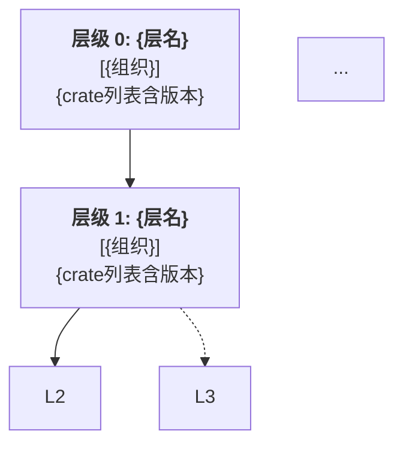

# 复杂 Crate 项目依赖分析规范

本规范由 **axvisor** 和 **StarryOS** 两个实际多组织协作 Rust 项目的依赖分析工作归纳提炼，为后续同类项目提供可复用的分析框架和工具规范。

---

## 1. 概述

### 1.1 适用场景

本规范适用于满足以下特征的 Rust 项目：

- **多组织协作**：项目依赖来自多个 GitHub 组织（如 arceos-org、rcore-os、drivercraft 等）
- **规模较大**：Cargo.lock 中 crate 数量超过 100 个
- **需要区分内外**：需要清晰区分"内部自研 crate"与"第三方外部 crate"
- **存在层次结构**：crate 之间有明确的分层依赖架构

### 1.2 分析目标

1. 从 Cargo.lock 中精确提取所有内部（自研）crate 的名称、版本和来源
2. 绘制内部 crate 间的依赖关系图（带版本号）
3. 识别 crate 的层级架构，输出分层视图
4. 统计外部依赖的类别分布

### 1.3 参考案例

| 项目 | 类型 | 组织数 | 总 crate 数 | 内部 crate 数 | 分析文档 |
|------|------|--------|------------|--------------|---------|
| axvisor | Type-1 Hypervisor | 5 | 583 | 115 | [axvisor-dependency.md](axvisor-dependency.md) |
| StarryOS | 宏内核 OS | 4（无 arceos-hypervisor）| 348 | 102 | [starryos-dependency.md](starryos-dependency.md) |

---

## 2. 准备工作

### 2.1 确定"内部组织"范围

在开始分析前，先列出所有需要重点分析的 GitHub 组织：

```
# 示例：五大组织
- Starry-OS           https://github.com/Starry-OS
- arceos-org          https://github.com/arceos-org
- rcore-os            https://github.com/rcore-os
- arceos-hypervisor   https://github.com/arceos-hypervisor
- drivercraft         https://github.com/drivercraft
```

### 2.2 建立初始归属表

通过以下三种方式综合判断每个 crate 的归属：

**方式 ①：检查 `source` 字段（最可靠）**
```toml
# Cargo.lock 中以 git+https://github.com/<组织>/ 开头的 source
source = "git+https://github.com/arceos-org/arceos?branch=main#abc123"
# → 直接归属 arceos-org
```

**方式 ②：crate 名称前缀规律（常见模式）**

| 前缀/模式 | 常见归属 | 示例 |
|----------|---------|------|
| `ax*` | arceos-org | `axhal`、`axtask`、`axmm` |
| `starry-*` | Starry-OS | `starry-process`、`starry-signal` |
| `rdif-*`、`rdrive*` | drivercraft | `rdif-intc`、`rdrive` |
| `somehal*`、`someboot*` | rcore-os | `somehal`、`someboot` |

> **注意**：crates.io 发布的 crate 无 git source，需通过名称+已知文档交叉确认。

**方式 ③：查阅项目文档或 README**
- 查看各组织 GitHub 主页的仓库列表
- 查阅项目的 NOTICE、CONTRIBUTING 等文件

### 2.3 工具依赖

分析工具 [`analyze_cargo_lock.py`](../tools/analyze_cargo_lock.py) 仅依赖 Python 3 标准库：

```
Python >= 3.10（使用了 list[dict] 类型注解）
标准库：re、json、sys、argparse、collections
```

---

## 3. 解析工具规范

工具路径：[`axcrates/tools/analyze_cargo_lock.py`](../tools/analyze_cargo_lock.py)

### 3.1 命令行接口

```bash
python3 analyze_cargo_lock.py \
  --lock  <Cargo.lock 路径>    \  # 默认: ./Cargo.lock
  --output <输出 JSON 路径>     \  # 默认: stdout（用 - 表示）
```

**示例**：
```bash
# 分析 StarryOS
python3 axcrates/tools/analyze_cargo_lock.py \
  --lock StarryOS/Cargo.lock \
  --output /tmp/starryos_analysis.json

# 分析 axvisor
python3 axcrates/tools/analyze_cargo_lock.py \
  --lock os/axvisor/Cargo.lock \
  --output /tmp/axvisor_analysis.json
```

### 3.2 内部处理流程

```
Cargo.lock
    │
    ▼
① 解析所有 [[package]] 块
   → (name, version, source, [dependency_names])
    │
    ▼
② 按归属表分类每个 package
   ORG_CRATE_MAP（精确匹配）
   + git source URL 匹配
   + 未命中 → external
    │
    ▼
③ 提取内部依赖有向边
   仅保留 internal → internal 的边
   处理多版本：同名不同版本各自独立节点
    │
    ▼
④ 生成 mermaid 安全节点 ID
   规则：- 和 . 均替换为 _，追加版本后缀
    │
    ▼
⑤ 按层级规则分配 crate 到架构层
   LAYER_RULES（可配置）
    │
    ▼
⑥ 外部 crate 按类别归类
   EXTERNAL_CATEGORIES（关键词匹配）
    │
    ▼
输出 JSON
```

### 3.3 输出 JSON 结构

```json
{
  "stats": {
    "total_crates":    348,
    "internal_crates": 102,
    "external_crates": 246,
    "by_org": {
      "starry-os": 11,
      "arceos-org": 68,
      "rcore-os": 11,
      "arceos-hypervisor": 0,
      "drivercraft": 12
    }
  },
  "orgs": {
    "starry-os": [
      {
        "name":       "starryos",
        "version":    "0.3.0-preview.2",
        "node_id":    "starryos_v0_3_0_preview_2",
        "label":      "starryos_v0_3_0_preview_2[\"starryos\\nv0.3.0-preview.2\"]",
        "layer":      0,
        "layer_name": "内核入口层",
        "source":     "local"
      }
    ]
  },
  "edges": [
    {
      "from":      "starryos_v0_3_0_preview_2",
      "to":        "starry_kernel_v0_2_0_preview_1",
      "from_name": "starryos",
      "from_ver":  "0.3.0-preview.2",
      "to_name":   "starry-kernel",
      "to_ver":    "0.2.0-preview.1"
    }
  ],
  "layers": {
    "0": [ { "node_id": "...", "name": "...", "version": "...", "org": "...", "layer_name": "..." } ]
  },
  "external_cats": {
    "宏/代码生成": ["syn 2.0.101", "quote 1.0.40"],
    "嵌入式/裸机": ["tock-registers 0.10.1"]
  }
}
```

---

## 4. 节点 ID 与版本号规范

### 4.1 节点 ID 生成规则

| 场景 | 规则 | 示例 |
|------|------|------|
| 基本 ID | `{name}` 中 `-` 和 `.` 均替换为 `_`，追加 `_v{ver}`（ver 中 `-` 和 `.` 替换为 `_`） | `axerrno_v0_2_2` |
| 多版本区分 | 同名不同版本各自生成独立 ID | `axerrno_v0_1_2`、`axerrno_v0_2_2` |
| 预览版本 | 版本中的 `preview`、`pre` 保留，特殊字符转义 | `axalloc_v0_3_0_preview_2` |

### 4.2 节点 Label 格式

mermaid 节点 label 格式统一为：

```
{node_id}["{crate-name}\nv{version}"]
```

示例：
```
axerrno_v0_2_2["axerrno\nv0.2.2"]
arm_gic_driver_v0_17_0["arm-gic-driver\nv0.17.0"]
```

### 4.3 依赖边规则

- 依赖边**必须**指向带版本后缀的具体节点 ID，不使用通配
- 多版本 crate 被依赖时，需确认依赖方使用的具体版本，分别指向对应版本节点
- 仅展示**内部 crate 之间**的依赖边，不展示指向外部 crate 的边

---

## 5. 文档四节模板规范

每份依赖分析文档须包含以下四节，格式统一，可用 JSON 数据自动生成。

### §1 统计概览

```markdown
## 1. 统计概览

| 指标 | 数值 |
|------|------|
| Cargo.lock 总 crate 数 | **{total}** |
| 五大组织 crate 数（含多版本条目） | **{internal}** |
| 外部依赖 crate 数 | **{external}** |

| 组织 | Crate 数 | 代表性 crate | 说明 |
|------|---------|-------------|------|
| **{org}** | {count} | `crate1` `crate2` | {描述} |
```

**要求**：
- 多版本条目（如 `axerrno 0.1.2` 和 `axerrno 0.2.2`）单独计数
- 说明列需注明多版本情况（如"含 arm-gic-driver 两个版本"）

### §2 组件依赖关系图

```markdown
## 2. 组件依赖关系图

```mermaid
flowchart TB
    subgraph {org_id}["<b>{org_name}</b>"]
        direction TB
        {node_label}
        ...
    end
    ...
    %% 内部依赖边
    {from_id} --> {to_id}
    ...
    classDef {class} fill:{color},stroke:{border},stroke-width:2px
    class {node_id} {class}
```
```

**要求**：
- 每个组织独立一个 `subgraph`，ID 用下划线替换连字符
- 节点 label 含 `\n` 换行显示版本号
- `classDef` 固定 5 色方案（见下表）
- `class` 语句按组织批量赋色

**5 色方案**：

| 组织 | fill | stroke |
|------|------|--------|
| starry-os | `#fce4ec` | `#c2185b` |
| arceos-org | `#e8f5e9` | `#2e7d32` |
| rcore-os | `#f3e5f1` | `#880e4f` |
| arceos-hypervisor | `#e1f5fe` | `#01579b` |
| drivercraft | `#fff3e0` | `#ef6c00` |

### §3 组件层级架构图

```markdown
## 3. 组件层级架构


```

**要求**：
- 层数根据项目架构特点确定（一般 6-9 层）
- 节点文字含层级编号、层名、所属组织标识和 crate 版本
- 顺序依赖用实线 `-->`，跨层依赖用虚线 `-.->` 标注
- 超过 15 个 crate 的层级可省略展示，标注"共 N 个"

### §4 层级架构列表

**4.1 内部依赖列表**（精确，含版本列）：

```markdown
| 层级 | 层名 | 组织 | crate 名称 | 版本 |
|------|------|------|-----------|------|
| L0 | 内核入口层 | `starry-os` | `starryos` | `0.3.0-preview.2` |
...
**内部 crate 合计：N 个（含多版本条目）**
```

**4.2 外部依赖列表**（按类别统计）：

```markdown
| 类别 | 数量 | 示例 crate |
|------|------|------------|
| 宏/代码生成 | 33 | `syn`, `quote`, `proc-macro2` 等 |
...
| **合计** | **N** | — |
```

**外部依赖推荐类别**（按 StarryOS 实践）：

| 类别 | 关键词 |
|------|--------|
| 序列化/数据格式 | serde, toml, json, byteorder |
| 异步/并发 | tokio, futures, async, crossbeam |
| 网络/协议 | http, hyper, smoltcp, socket2 |
| 加密/安全 | digest, sha, rand, ring |
| 日志/错误 | log, tracing, anyhow, thiserror |
| 命令行/配置 | clap, bitflags, semver |
| 系统/平台 | libc, linux-raw-sys, riscv, x86_64 |
| 宏/代码生成 | syn, quote, proc-macro, derive |
| 嵌入式/裸机 | tock-registers, embedded, defmt, uefi |
| 数据结构/算法 | hashbrown, smallvec, bitvec, lru |
| 设备树/固件解析 | fdt, xmas-elf, kernel-elf-parser |
| 工具库/其他 | （兜底） |

---

## 6. 组织归属决策树

```
对 Cargo.lock 中每个 [[package]]：
    │
    ├─ source 含 git+https://github.com/<组织>/
    │       └─ → 直接归属该组织
    │
    └─ source = "registry+...crates.io..." 或无 source（本地包）
            │
            ├─ 在 ORG_CRATE_MAP 精确名称表中命中
            │       └─ → 归属对应组织
            │
            ├─ 名称前缀匹配
            │   ax*          → arceos-org
            │   starry-*     → Starry-OS
            │   rdif-*/rdrive* → drivercraft
            │   somehal*/someboot* → rcore-os
            │       └─ → 归属对应组织（需人工确认）
            │
            └─ 无命中
                    └─ → 归为"外部 crate"，进入类别分类
```

---

## 7. 适配新项目步骤（Checklist）

### Step 1：配置归属表

打开 `analyze_cargo_lock.py`，修改 `ORG_CRATE_MAP`：

```python
ORG_CRATE_MAP = {
    # ── 你的组织 ──
    "my-crate-a": "my-org",
    "my-crate-b": "my-org",
    # ...
}
```

### Step 2：配置层级规则

修改 `LAYER_RULES`，根据你的项目架构特点调整层数和层含义：

```python
LAYER_RULES = [
    (0, "应用/入口层",    {"my-app"}),
    (1, "核心逻辑层",     {"my-core-a", "my-core-b"}),
    (2, "框架层",        {"my-framework"}),
    # ... 按需增减层级
]
```

### Step 3：首次运行并检查 unknown

```bash
python3 analyze_cargo_lock.py --lock path/to/Cargo.lock > /tmp/result.json
# 检查是否有本应属于内部的 crate 被分到 external
python3 -c "
import json
data = json.load(open('/tmp/result.json'))
print([p for p in data.get('external_cats', {}).get('工具库/其他', [])
       if '你认识的组织crate名' in p])
"
```

将漏判的 crate 补充到 `ORG_CRATE_MAP` 后重跑，直到 `unknown/external` 中无内部 crate。

### Step 4：生成文档

使用输出 JSON 中的结构化数据填充§1-§4 模板，或直接使用以下脚本（仿照 StarryOS 分析的生成方式）：

```bash
# 直接套用生成脚本模式（参考 starryos-dependency.md 的生成过程）
python3 generate_doc.py \
  --data /tmp/result.json \
  --output docs/<项目名>-dependency.md
```

### Step 5：人工审核

生成文档后，建议人工确认：
- [ ] 依赖图中有无明显遗漏的边
- [ ] 层级分配是否符合项目实际架构意图
- [ ] 多版本 crate 的依赖方向是否正确
- [ ] mermaid 语法在渲染器中是否正常显示（节点 ID 无保留关键字）

---

## 8. 常见问题

**Q：所有 crate 都从 crates.io 发布，如何判断归属？**

A：通过名称规律 + 查阅对应 GitHub 组织的仓库列表。对于不确定的 crate，可在 crates.io 页面查看 "Repository" 字段确认 GitHub 来源。

**Q：同一个 crate 出现两个版本怎么处理？**

A：在图中各自保留为独立节点（ID 含版本后缀），依赖边分别指向具体版本。在统计表中单独计数，在说明列中注明。

**Q：层级架构图的 mermaid 节点太多渲染不出来？**

A：对于 crate 数量超过 20 的层级，在层级节点的 label 中只展示前 15 个 crate 名称，并标注"共 N 个"。完整列表在 §4.1 的表格中呈现。

**Q：如何检测循环依赖？**

A：运行以下命令检查 edges 中是否存在环路：
```bash
python3 -c "
import json
from collections import defaultdict

data = json.load(open('/tmp/result.json'))
adj = defaultdict(set)
for e in data['edges']:
    adj[e['from']].add(e['to'])

def dfs(node, visited, stack):
    visited.add(node)
    stack.add(node)
    for nb in adj.get(node, []):
        if nb not in visited:
            if dfs(nb, visited, stack):
                return True
        elif nb in stack:
            print(f'循环依赖: {node} -> {nb}')
            return True
    stack.discard(node)
    return False

visited = set()
for node in adj:
    if node not in visited:
        dfs(node, visited, set())
"
```

---

## 附录：工具文件清单

| 文件 | 用途 |
|------|------|
| [`axcrates/tools/analyze_cargo_lock.py`](../tools/analyze_cargo_lock.py) | 通用解析工具（修改 `ORG_CRATE_MAP` 和 `LAYER_RULES` 后可适配任意项目） |
| [`axcrates/docs/axvisor-dependency.md`](axvisor-dependency.md) | axvisor Hypervisor 项目依赖分析（参考案例 1）|
| [`axcrates/docs/starryos-dependency.md`](starryos-dependency.md) | StarryOS 宏内核项目依赖分析（参考案例 2）|
| [`axcrates/docs/crate-dependency-analysis-guide.md`](crate-dependency-analysis-guide.md) | 本规范文档 |
