# StarryOS 依赖关系分析

本文档展示了 StarryOS（支持 riscv64、aarch64、loongarch64、x86_64 四种处理器架构的宏内核）的组件依赖关系。

数据由 [`axcrates/tools/analyze_cargo_lock.py`](../tools/analyze_cargo_lock.py) 解析 `StarryOS/Cargo.lock` 自动生成。

## 1. 统计概览

| 指标 | 数值 |
|------|------|
| Cargo.lock 总 crate 数 | **348** |
| 五大组织 crate 数（含多版本条目） | **102** |
| 外部依赖 crate 数 | **246** |

| 组织 | Crate 数 | 代表性 crate | 说明 |
|------|---------|-------------|------|
| **Starry-OS** | 11 | `starryos` `starry-kernel` `starry-process` `starry-signal` | OS 核心业务逻辑层，包含进程/信号/网络协议栈定制 |
| **arceos-org** | 68 | `axhal` `axtask` `axmm` `axfs-ng` `axdriver` | ArceOS unikernel 框架全部模块，含多版本 `axerrno`、`crate_interface` |
| **rcore-os** | 11 | `somehal` `virtio-drivers` `arm-gic-driver` | 底层硬件抽象与通用驱动库，`arm-gic-driver` 含 0.16.4/0.17.0 两版本 |
| **arceos-hypervisor** | 0 | — | StarryOS 为宏内核，不含 Hypervisor 相关 crate |
| **drivercraft** | 12 | `rdrive` `rdif-intc` `rdif-base` | RDIF 驱动接口框架，`rdif-base` 含 0.7.0/0.8.0 两版本 |

## 2. 组件依赖关系图

节点格式为 `crate名称 / 版本号`，颜色按组织区分。

```mermaid
flowchart TB
    subgraph starry_os["<b>starry-os</b>"]
        direction TB
        starryos_v0_3_0_preview_2["starryos\nv0.3.0-preview.2"]
        starry_kernel_v0_2_0_preview_1["starry-kernel\nv0.2.0-preview.1"]
        starry_process_v0_2_0["starry-process\nv0.2.0"]
        starry_signal_v0_3_0["starry-signal\nv0.3.0"]
        starry_smoltcp_v0_12_1_preview_1["starry-smoltcp\nv0.12.1-preview.1"]
        starry_vm_v0_3_0["starry-vm\nv0.3.0"]
        axbacktrace_v0_1_1["axbacktrace\nv0.1.1"]
        axpoll_v0_1_2["axpoll\nv0.1.2"]
        axfs_ng_vfs_v0_1_0["axfs-ng-vfs\nv0.1.0"]
        rsext4_v0_1_0_pre_0["rsext4\nv0.1.0-pre.0"]
        scope_local_v0_1_2["scope-local\nv0.1.2"]
    end

    subgraph arceos_org["<b>arceos-org</b>"]
        direction TB
        axfeat_v0_3_0_preview_2["axfeat\nv0.3.0-preview.2"]
        axruntime_v0_3_0_preview_2["axruntime\nv0.3.0-preview.2"]
        axalloc_v0_3_0_preview_2["axalloc\nv0.3.0-preview.2"]
        axdisplay_v0_3_0_preview_2["axdisplay\nv0.3.0-preview.2"]
        axfs_ng_v0_3_0_preview_2["axfs-ng\nv0.3.0-preview.2"]
        axhal_v0_3_0_preview_2["axhal\nv0.3.0-preview.2"]
        axinput_v0_3_0_preview_2["axinput\nv0.3.0-preview.2"]
        axio_v0_3_0_pre_1["axio\nv0.3.0-pre.1"]
        axlog_v0_3_0_preview_2["axlog\nv0.3.0-preview.2"]
        axmm_v0_3_0_preview_2["axmm\nv0.3.0-preview.2"]
        axnet_v0_3_0_preview_2["axnet\nv0.3.0-preview.2"]
        axnet_ng_v0_3_0_preview_2["axnet-ng\nv0.3.0-preview.2"]
        axsync_v0_3_0_preview_2["axsync\nv0.3.0-preview.2"]
        axtask_v0_3_0_preview_2["axtask\nv0.3.0-preview.2"]
        axdriver_v0_3_0_preview_2["axdriver\nv0.3.0-preview.2"]
        axdriver_base_v0_1_4_preview_3["axdriver_base\nv0.1.4-preview.3"]
        axdriver_block_v0_1_4_preview_3["axdriver_block\nv0.1.4-preview.3"]
        axdriver_display_v0_1_4_preview_3["axdriver_display\nv0.1.4-preview.3"]
        axdriver_input_v0_1_4_preview_3["axdriver_input\nv0.1.4-preview.3"]
        axdriver_net_v0_1_4_preview_3["axdriver_net\nv0.1.4-preview.3"]
        axdriver_pci_v0_1_4_preview_3["axdriver_pci\nv0.1.4-preview.3"]
        axdriver_virtio_v0_1_4_preview_3["axdriver_virtio\nv0.1.4-preview.3"]
        axdriver_vsock_v0_1_4_preview_3["axdriver_vsock\nv0.1.4-preview.3"]
        axfatfs_v0_1_0_pre_0["axfatfs\nv0.1.0-pre.0"]
        axfs_v0_3_0_preview_2["axfs\nv0.3.0-preview.2"]
        axfs_devfs_v0_1_2["axfs_devfs\nv0.1.2"]
        axfs_ramfs_v0_1_2["axfs_ramfs\nv0.1.2"]
        axfs_vfs_v0_1_2["axfs_vfs\nv0.1.2"]
        arm_pl011_v0_1_0["arm_pl011\nv0.1.0"]
        arm_pl031_v0_2_1["arm_pl031\nv0.2.1"]
        ax_slab_allocator_v0_4_0["ax_slab_allocator\nv0.4.0"]
        axallocator_v0_2_0["axallocator\nv0.2.0"]
        axconfig_v0_3_0_preview_2["axconfig\nv0.3.0-preview.2"]
        axconfig_gen_v0_2_1["axconfig-gen\nv0.2.1"]
        axconfig_macros_v0_2_1["axconfig-macros\nv0.2.1"]
        axcpu_v0_3_0_preview_8["axcpu\nv0.3.0-preview.8"]
        axklib_v0_3_0["axklib\nv0.3.0"]
        axplat_v0_3_1_pre_6["axplat\nv0.3.1-pre.6"]
        axplat_aarch64_peripherals_v0_3_1_pre_6["axplat-aarch64-peripherals\nv0.3.1-pre.6"]
        axplat_aarch64_qemu_virt_v0_3_1_pre_6["axplat-aarch64-qemu-virt\nv0.3.1-pre.6"]
        axplat_dyn_v0_3_0_preview_2["axplat-dyn\nv0.3.0-preview.2"]
        axplat_loongarch64_qemu_virt_v0_3_1_pre_6["axplat-loongarch64-qemu-virt\nv0.3.1-pre.6"]
        axplat_macros_v0_1_0["axplat-macros\nv0.1.0"]
        axplat_riscv64_qemu_virt_v0_3_1_pre_6["axplat-riscv64-qemu-virt\nv0.3.1-pre.6"]
        axplat_riscv64_visionfive2_v0_1_0_pre_2["axplat-riscv64-visionfive2\nv0.1.0-pre.2"]
        axplat_x86_pc_v0_3_1_pre_6["axplat-x86-pc\nv0.3.1-pre.6"]
        axsched_v0_3_1["axsched\nv0.3.1"]
        cap_access_v0_1_0["cap_access\nv0.1.0"]
        int_ratio_v0_1_2["int_ratio\nv0.1.2"]
        riscv_plic_v0_2_0["riscv_plic\nv0.2.0"]
        axerrno_v0_1_2["axerrno\nv0.1.2"]
        axerrno_v0_2_2["axerrno\nv0.2.2"]
        cpumask_v0_1_0["cpumask\nv0.1.0"]
        crate_interface_v0_1_4["crate_interface\nv0.1.4"]
        crate_interface_v0_3_0["crate_interface\nv0.3.0"]
        ctor_bare_v0_2_1["ctor_bare\nv0.2.1"]
        ctor_bare_macros_v0_2_1["ctor_bare_macros\nv0.2.1"]
        handler_table_v0_1_2["handler_table\nv0.1.2"]
        kernel_guard_v0_1_3["kernel_guard\nv0.1.3"]
        kspin_v0_1_1["kspin\nv0.1.1"]
        lazyinit_v0_2_2["lazyinit\nv0.2.2"]
        linked_list_r4l_v0_3_0["linked_list_r4l\nv0.3.0"]
        memory_addr_v0_4_1["memory_addr\nv0.4.1"]
        memory_set_v0_4_1["memory_set\nv0.4.1"]
        page_table_entry_v0_6_1["page_table_entry\nv0.6.1"]
        page_table_multiarch_v0_6_1["page_table_multiarch\nv0.6.1"]
        percpu_v0_2_3_preview_1["percpu\nv0.2.3-preview.1"]
        percpu_macros_v0_2_3_preview_1["percpu_macros\nv0.2.3-preview.1"]
    end

    subgraph rcore_os["<b>rcore-os</b>"]
        direction TB
        arm_gic_driver_v0_16_4["arm-gic-driver\nv0.16.4"]
        arm_gic_driver_v0_17_0["arm-gic-driver\nv0.17.0"]
        bitmap_allocator_v0_2_1["bitmap-allocator\nv0.2.1"]
        kasm_aarch64_v0_2_0["kasm-aarch64\nv0.2.0"]
        num_align_v0_1_0["num-align\nv0.1.0"]
        page_table_generic_v0_7_1["page-table-generic\nv0.7.1"]
        some_serial_v0_3_1["some-serial\nv0.3.1"]
        someboot_v0_1_4["someboot\nv0.1.4"]
        somehal_v0_6_0["somehal\nv0.6.0"]
        somehal_macros_v0_1_1["somehal-macros\nv0.1.1"]
        virtio_drivers_v0_7_5["virtio-drivers\nv0.7.5"]
    end

    subgraph drivercraft["<b>drivercraft</b>"]
        direction TB
        rdif_intc_v0_14_0["rdif-intc\nv0.14.0"]
        rdif_pcie_v0_2_0["rdif-pcie\nv0.2.0"]
        rdrive_v0_19_0["rdrive\nv0.19.0"]
        aarch64_cpu_ext_v0_1_4["aarch64-cpu-ext\nv0.1.4"]
        dma_api_v0_5_2["dma-api\nv0.5.2"]
        mbarrier_v0_1_3["mbarrier\nv0.1.3"]
        pcie_v0_5_0["pcie\nv0.5.0"]
        rdif_base_v0_7_0["rdif-base\nv0.7.0"]
        rdif_base_v0_8_0["rdif-base\nv0.8.0"]
        rdif_def_v0_2_1["rdif-def\nv0.2.1"]
        rdif_serial_v0_6_0["rdif-serial\nv0.6.0"]
        rdrive_macros_v0_4_1["rdrive-macros\nv0.4.1"]
    end

    %% ── 内部依赖边 ──
    arm_gic_driver_v0_17_0 --> rdif_intc_v0_14_0
    axalloc_v0_3_0_preview_2 --> axallocator_v0_2_0
    axalloc_v0_3_0_preview_2 --> axbacktrace_v0_1_1
    axalloc_v0_3_0_preview_2 --> axerrno_v0_1_2
    axalloc_v0_3_0_preview_2 --> axerrno_v0_2_2
    axalloc_v0_3_0_preview_2 --> kspin_v0_1_1
    axalloc_v0_3_0_preview_2 --> memory_addr_v0_4_1
    axalloc_v0_3_0_preview_2 --> percpu_v0_2_3_preview_1
    axallocator_v0_2_0 --> ax_slab_allocator_v0_4_0
    axallocator_v0_2_0 --> axerrno_v0_1_2
    axallocator_v0_2_0 --> axerrno_v0_2_2
    axallocator_v0_2_0 --> bitmap_allocator_v0_2_1
    axconfig_v0_3_0_preview_2 --> axconfig_macros_v0_2_1
    axconfig_macros_v0_2_1 --> axconfig_gen_v0_2_1
    axcpu_v0_3_0_preview_8 --> axbacktrace_v0_1_1
    axcpu_v0_3_0_preview_8 --> lazyinit_v0_2_2
    axcpu_v0_3_0_preview_8 --> memory_addr_v0_4_1
    axcpu_v0_3_0_preview_8 --> page_table_entry_v0_6_1
    axcpu_v0_3_0_preview_8 --> page_table_multiarch_v0_6_1
    axcpu_v0_3_0_preview_8 --> percpu_v0_2_3_preview_1
    axdisplay_v0_3_0_preview_2 --> axdriver_v0_3_0_preview_2
    axdisplay_v0_3_0_preview_2 --> axsync_v0_3_0_preview_2
    axdisplay_v0_3_0_preview_2 --> lazyinit_v0_2_2
    axdriver_v0_3_0_preview_2 --> axalloc_v0_3_0_preview_2
    axdriver_v0_3_0_preview_2 --> axconfig_v0_3_0_preview_2
    axdriver_v0_3_0_preview_2 --> axdriver_base_v0_1_4_preview_3
    axdriver_v0_3_0_preview_2 --> axdriver_block_v0_1_4_preview_3
    axdriver_v0_3_0_preview_2 --> axdriver_display_v0_1_4_preview_3
    axdriver_v0_3_0_preview_2 --> axdriver_input_v0_1_4_preview_3
    axdriver_v0_3_0_preview_2 --> axdriver_net_v0_1_4_preview_3
    axdriver_v0_3_0_preview_2 --> axdriver_pci_v0_1_4_preview_3
    axdriver_v0_3_0_preview_2 --> axdriver_virtio_v0_1_4_preview_3
    axdriver_v0_3_0_preview_2 --> axdriver_vsock_v0_1_4_preview_3
    axdriver_v0_3_0_preview_2 --> axhal_v0_3_0_preview_2
    axdriver_v0_3_0_preview_2 --> crate_interface_v0_1_4
    axdriver_v0_3_0_preview_2 --> crate_interface_v0_3_0
    axdriver_block_v0_1_4_preview_3 --> axdriver_base_v0_1_4_preview_3
    axdriver_display_v0_1_4_preview_3 --> axdriver_base_v0_1_4_preview_3
    axdriver_input_v0_1_4_preview_3 --> axdriver_base_v0_1_4_preview_3
    axdriver_net_v0_1_4_preview_3 --> axdriver_base_v0_1_4_preview_3
    axdriver_pci_v0_1_4_preview_3 --> virtio_drivers_v0_7_5
    axdriver_virtio_v0_1_4_preview_3 --> axdriver_base_v0_1_4_preview_3
    axdriver_virtio_v0_1_4_preview_3 --> axdriver_block_v0_1_4_preview_3
    axdriver_virtio_v0_1_4_preview_3 --> axdriver_display_v0_1_4_preview_3
    axdriver_virtio_v0_1_4_preview_3 --> axdriver_input_v0_1_4_preview_3
    axdriver_virtio_v0_1_4_preview_3 --> axdriver_net_v0_1_4_preview_3
    axdriver_virtio_v0_1_4_preview_3 --> virtio_drivers_v0_7_5
    axdriver_vsock_v0_1_4_preview_3 --> axdriver_base_v0_1_4_preview_3
    axerrno_v0_1_2 --> axerrno_v0_1_2
    axerrno_v0_1_2 --> axerrno_v0_2_2
    axfeat_v0_3_0_preview_2 --> axalloc_v0_3_0_preview_2
    axfeat_v0_3_0_preview_2 --> axbacktrace_v0_1_1
    axfeat_v0_3_0_preview_2 --> axdisplay_v0_3_0_preview_2
    axfeat_v0_3_0_preview_2 --> axdriver_v0_3_0_preview_2
    axfeat_v0_3_0_preview_2 --> axfs_v0_3_0_preview_2
    axfeat_v0_3_0_preview_2 --> axfs_ng_v0_3_0_preview_2
    axfeat_v0_3_0_preview_2 --> axhal_v0_3_0_preview_2
    axfeat_v0_3_0_preview_2 --> axinput_v0_3_0_preview_2
    axfeat_v0_3_0_preview_2 --> axlog_v0_3_0_preview_2
    axfeat_v0_3_0_preview_2 --> axnet_v0_3_0_preview_2
    axfeat_v0_3_0_preview_2 --> axruntime_v0_3_0_preview_2
    axfeat_v0_3_0_preview_2 --> axsync_v0_3_0_preview_2
    axfeat_v0_3_0_preview_2 --> axtask_v0_3_0_preview_2
    axfeat_v0_3_0_preview_2 --> kspin_v0_1_1
    axfs_v0_3_0_preview_2 --> axdriver_v0_3_0_preview_2
    axfs_v0_3_0_preview_2 --> axerrno_v0_1_2
    axfs_v0_3_0_preview_2 --> axerrno_v0_2_2
    axfs_v0_3_0_preview_2 --> axfatfs_v0_1_0_pre_0
    axfs_v0_3_0_preview_2 --> axfs_devfs_v0_1_2
    axfs_v0_3_0_preview_2 --> axfs_ramfs_v0_1_2
    axfs_v0_3_0_preview_2 --> axfs_vfs_v0_1_2
    axfs_v0_3_0_preview_2 --> axio_v0_3_0_pre_1
    axfs_v0_3_0_preview_2 --> cap_access_v0_1_0
    axfs_v0_3_0_preview_2 --> lazyinit_v0_2_2
    axfs_v0_3_0_preview_2 --> rsext4_v0_1_0_pre_0
    axfs_ng_v0_3_0_preview_2 --> axalloc_v0_3_0_preview_2
    axfs_ng_v0_3_0_preview_2 --> axdriver_v0_3_0_preview_2
    axfs_ng_v0_3_0_preview_2 --> axerrno_v0_1_2
    axfs_ng_v0_3_0_preview_2 --> axerrno_v0_2_2
    axfs_ng_v0_3_0_preview_2 --> axfs_ng_vfs_v0_1_0
    axfs_ng_v0_3_0_preview_2 --> axhal_v0_3_0_preview_2
    axfs_ng_v0_3_0_preview_2 --> axio_v0_3_0_pre_1
    axfs_ng_v0_3_0_preview_2 --> axpoll_v0_1_2
    axfs_ng_v0_3_0_preview_2 --> axsync_v0_3_0_preview_2
    axfs_ng_v0_3_0_preview_2 --> kspin_v0_1_1
    axfs_ng_v0_3_0_preview_2 --> scope_local_v0_1_2
    axfs_ng_vfs_v0_1_0 --> axerrno_v0_1_2
    axfs_ng_vfs_v0_1_0 --> axerrno_v0_2_2
    axfs_ng_vfs_v0_1_0 --> axpoll_v0_1_2
    axfs_devfs_v0_1_2 --> axfs_vfs_v0_1_2
    axfs_ramfs_v0_1_2 --> axfs_vfs_v0_1_2
    axfs_vfs_v0_1_2 --> axerrno_v0_1_2
    axfs_vfs_v0_1_2 --> axerrno_v0_2_2
    axhal_v0_3_0_preview_2 --> axalloc_v0_3_0_preview_2
    axhal_v0_3_0_preview_2 --> axconfig_v0_3_0_preview_2
    axhal_v0_3_0_preview_2 --> axcpu_v0_3_0_preview_8
    axhal_v0_3_0_preview_2 --> axplat_v0_3_1_pre_6
    axhal_v0_3_0_preview_2 --> axplat_aarch64_qemu_virt_v0_3_1_pre_6
    axhal_v0_3_0_preview_2 --> axplat_dyn_v0_3_0_preview_2
    axhal_v0_3_0_preview_2 --> axplat_loongarch64_qemu_virt_v0_3_1_pre_6
    axhal_v0_3_0_preview_2 --> axplat_riscv64_qemu_virt_v0_3_1_pre_6
    axhal_v0_3_0_preview_2 --> axplat_x86_pc_v0_3_1_pre_6
    axhal_v0_3_0_preview_2 --> kernel_guard_v0_1_3
    axhal_v0_3_0_preview_2 --> memory_addr_v0_4_1
    axhal_v0_3_0_preview_2 --> page_table_multiarch_v0_6_1
    axhal_v0_3_0_preview_2 --> percpu_v0_2_3_preview_1
    axinput_v0_3_0_preview_2 --> axdriver_v0_3_0_preview_2
    axinput_v0_3_0_preview_2 --> axsync_v0_3_0_preview_2
    axinput_v0_3_0_preview_2 --> lazyinit_v0_2_2
    axio_v0_3_0_pre_1 --> axerrno_v0_1_2
    axio_v0_3_0_pre_1 --> axerrno_v0_2_2
    axklib_v0_3_0 --> axerrno_v0_1_2
    axklib_v0_3_0 --> axerrno_v0_2_2
    axklib_v0_3_0 --> memory_addr_v0_4_1
    axlog_v0_3_0_preview_2 --> crate_interface_v0_1_4
    axlog_v0_3_0_preview_2 --> crate_interface_v0_3_0
    axlog_v0_3_0_preview_2 --> kspin_v0_1_1
    axmm_v0_3_0_preview_2 --> axalloc_v0_3_0_preview_2
    axmm_v0_3_0_preview_2 --> axerrno_v0_1_2
    axmm_v0_3_0_preview_2 --> axerrno_v0_2_2
    axmm_v0_3_0_preview_2 --> axhal_v0_3_0_preview_2
    axmm_v0_3_0_preview_2 --> kspin_v0_1_1
    axmm_v0_3_0_preview_2 --> lazyinit_v0_2_2
    axmm_v0_3_0_preview_2 --> memory_addr_v0_4_1
    axmm_v0_3_0_preview_2 --> memory_set_v0_4_1
    axnet_v0_3_0_preview_2 --> axdriver_v0_3_0_preview_2
    axnet_v0_3_0_preview_2 --> axerrno_v0_1_2
    axnet_v0_3_0_preview_2 --> axerrno_v0_2_2
    axnet_v0_3_0_preview_2 --> axhal_v0_3_0_preview_2
    axnet_v0_3_0_preview_2 --> axio_v0_3_0_pre_1
    axnet_v0_3_0_preview_2 --> axsync_v0_3_0_preview_2
    axnet_v0_3_0_preview_2 --> axtask_v0_3_0_preview_2
    axnet_v0_3_0_preview_2 --> lazyinit_v0_2_2
    axnet_v0_3_0_preview_2 --> starry_smoltcp_v0_12_1_preview_1
    axnet_ng_v0_3_0_preview_2 --> axconfig_v0_3_0_preview_2
    axnet_ng_v0_3_0_preview_2 --> axdriver_v0_3_0_preview_2
    axnet_ng_v0_3_0_preview_2 --> axerrno_v0_1_2
    axnet_ng_v0_3_0_preview_2 --> axerrno_v0_2_2
    axnet_ng_v0_3_0_preview_2 --> axfs_ng_v0_3_0_preview_2
    axnet_ng_v0_3_0_preview_2 --> axfs_ng_vfs_v0_1_0
    axnet_ng_v0_3_0_preview_2 --> axhal_v0_3_0_preview_2
    axnet_ng_v0_3_0_preview_2 --> axio_v0_3_0_pre_1
    axnet_ng_v0_3_0_preview_2 --> axpoll_v0_1_2
    axnet_ng_v0_3_0_preview_2 --> axsync_v0_3_0_preview_2
    axnet_ng_v0_3_0_preview_2 --> axtask_v0_3_0_preview_2
    axnet_ng_v0_3_0_preview_2 --> starry_smoltcp_v0_12_1_preview_1
    axplat_v0_3_1_pre_6 --> axplat_macros_v0_1_0
    axplat_v0_3_1_pre_6 --> crate_interface_v0_1_4
    axplat_v0_3_1_pre_6 --> crate_interface_v0_3_0
    axplat_v0_3_1_pre_6 --> handler_table_v0_1_2
    axplat_v0_3_1_pre_6 --> kspin_v0_1_1
    axplat_v0_3_1_pre_6 --> memory_addr_v0_4_1
    axplat_v0_3_1_pre_6 --> percpu_v0_2_3_preview_1
    axplat_aarch64_peripherals_v0_3_1_pre_6 --> arm_gic_driver_v0_16_4
    axplat_aarch64_peripherals_v0_3_1_pre_6 --> arm_gic_driver_v0_17_0
    axplat_aarch64_peripherals_v0_3_1_pre_6 --> arm_pl011_v0_1_0
    axplat_aarch64_peripherals_v0_3_1_pre_6 --> arm_pl031_v0_2_1
    axplat_aarch64_peripherals_v0_3_1_pre_6 --> axcpu_v0_3_0_preview_8
    axplat_aarch64_peripherals_v0_3_1_pre_6 --> axplat_v0_3_1_pre_6
    axplat_aarch64_peripherals_v0_3_1_pre_6 --> int_ratio_v0_1_2
    axplat_aarch64_peripherals_v0_3_1_pre_6 --> kspin_v0_1_1
    axplat_aarch64_peripherals_v0_3_1_pre_6 --> lazyinit_v0_2_2
    axplat_aarch64_qemu_virt_v0_3_1_pre_6 --> axconfig_macros_v0_2_1
    axplat_aarch64_qemu_virt_v0_3_1_pre_6 --> axcpu_v0_3_0_preview_8
    axplat_aarch64_qemu_virt_v0_3_1_pre_6 --> axplat_v0_3_1_pre_6
    axplat_aarch64_qemu_virt_v0_3_1_pre_6 --> axplat_aarch64_peripherals_v0_3_1_pre_6
    axplat_aarch64_qemu_virt_v0_3_1_pre_6 --> page_table_entry_v0_6_1
    axplat_dyn_v0_3_0_preview_2 --> axconfig_macros_v0_2_1
    axplat_dyn_v0_3_0_preview_2 --> axcpu_v0_3_0_preview_8
    axplat_dyn_v0_3_0_preview_2 --> axerrno_v0_1_2
    axplat_dyn_v0_3_0_preview_2 --> axerrno_v0_2_2
    axplat_dyn_v0_3_0_preview_2 --> axklib_v0_3_0
    axplat_dyn_v0_3_0_preview_2 --> axplat_v0_3_1_pre_6
    axplat_dyn_v0_3_0_preview_2 --> percpu_v0_2_3_preview_1
    axplat_dyn_v0_3_0_preview_2 --> somehal_v0_6_0
    axplat_loongarch64_qemu_virt_v0_3_1_pre_6 --> axconfig_macros_v0_2_1
    axplat_loongarch64_qemu_virt_v0_3_1_pre_6 --> axcpu_v0_3_0_preview_8
    axplat_loongarch64_qemu_virt_v0_3_1_pre_6 --> axplat_v0_3_1_pre_6
    axplat_loongarch64_qemu_virt_v0_3_1_pre_6 --> kspin_v0_1_1
    axplat_loongarch64_qemu_virt_v0_3_1_pre_6 --> lazyinit_v0_2_2
    axplat_loongarch64_qemu_virt_v0_3_1_pre_6 --> page_table_entry_v0_6_1
    axplat_riscv64_qemu_virt_v0_3_1_pre_6 --> axconfig_macros_v0_2_1
    axplat_riscv64_qemu_virt_v0_3_1_pre_6 --> axcpu_v0_3_0_preview_8
    axplat_riscv64_qemu_virt_v0_3_1_pre_6 --> axplat_v0_3_1_pre_6
    axplat_riscv64_qemu_virt_v0_3_1_pre_6 --> kspin_v0_1_1
    axplat_riscv64_qemu_virt_v0_3_1_pre_6 --> lazyinit_v0_2_2
    axplat_riscv64_qemu_virt_v0_3_1_pre_6 --> riscv_plic_v0_2_0
    axplat_riscv64_visionfive2_v0_1_0_pre_2 --> axconfig_macros_v0_2_1
    axplat_riscv64_visionfive2_v0_1_0_pre_2 --> axcpu_v0_3_0_preview_8
    axplat_riscv64_visionfive2_v0_1_0_pre_2 --> axplat_v0_3_1_pre_6
    axplat_riscv64_visionfive2_v0_1_0_pre_2 --> kspin_v0_1_1
    axplat_riscv64_visionfive2_v0_1_0_pre_2 --> lazyinit_v0_2_2
    axplat_riscv64_visionfive2_v0_1_0_pre_2 --> riscv_plic_v0_2_0
    axplat_x86_pc_v0_3_1_pre_6 --> axconfig_macros_v0_2_1
    axplat_x86_pc_v0_3_1_pre_6 --> axcpu_v0_3_0_preview_8
    axplat_x86_pc_v0_3_1_pre_6 --> axplat_v0_3_1_pre_6
    axplat_x86_pc_v0_3_1_pre_6 --> int_ratio_v0_1_2
    axplat_x86_pc_v0_3_1_pre_6 --> kspin_v0_1_1
    axplat_x86_pc_v0_3_1_pre_6 --> lazyinit_v0_2_2
    axplat_x86_pc_v0_3_1_pre_6 --> percpu_v0_2_3_preview_1
    axruntime_v0_3_0_preview_2 --> axalloc_v0_3_0_preview_2
    axruntime_v0_3_0_preview_2 --> axbacktrace_v0_1_1
    axruntime_v0_3_0_preview_2 --> axconfig_v0_3_0_preview_2
    axruntime_v0_3_0_preview_2 --> axdisplay_v0_3_0_preview_2
    axruntime_v0_3_0_preview_2 --> axdriver_v0_3_0_preview_2
    axruntime_v0_3_0_preview_2 --> axfs_v0_3_0_preview_2
    axruntime_v0_3_0_preview_2 --> axfs_ng_v0_3_0_preview_2
    axruntime_v0_3_0_preview_2 --> axhal_v0_3_0_preview_2
    axruntime_v0_3_0_preview_2 --> axinput_v0_3_0_preview_2
    axruntime_v0_3_0_preview_2 --> axklib_v0_3_0
    axruntime_v0_3_0_preview_2 --> axlog_v0_3_0_preview_2
    axruntime_v0_3_0_preview_2 --> axmm_v0_3_0_preview_2
    axruntime_v0_3_0_preview_2 --> axnet_v0_3_0_preview_2
    axruntime_v0_3_0_preview_2 --> axnet_ng_v0_3_0_preview_2
    axruntime_v0_3_0_preview_2 --> axplat_v0_3_1_pre_6
    axruntime_v0_3_0_preview_2 --> axtask_v0_3_0_preview_2
    axruntime_v0_3_0_preview_2 --> crate_interface_v0_1_4
    axruntime_v0_3_0_preview_2 --> crate_interface_v0_3_0
    axruntime_v0_3_0_preview_2 --> ctor_bare_v0_2_1
    axruntime_v0_3_0_preview_2 --> percpu_v0_2_3_preview_1
    axsched_v0_3_1 --> linked_list_r4l_v0_3_0
    axsync_v0_3_0_preview_2 --> axtask_v0_3_0_preview_2
    axsync_v0_3_0_preview_2 --> kspin_v0_1_1
    axtask_v0_3_0_preview_2 --> axconfig_v0_3_0_preview_2
    axtask_v0_3_0_preview_2 --> axerrno_v0_1_2
    axtask_v0_3_0_preview_2 --> axerrno_v0_2_2
    axtask_v0_3_0_preview_2 --> axhal_v0_3_0_preview_2
    axtask_v0_3_0_preview_2 --> axpoll_v0_1_2
    axtask_v0_3_0_preview_2 --> axsched_v0_3_1
    axtask_v0_3_0_preview_2 --> cpumask_v0_1_0
    axtask_v0_3_0_preview_2 --> crate_interface_v0_1_4
    axtask_v0_3_0_preview_2 --> crate_interface_v0_3_0
    axtask_v0_3_0_preview_2 --> kernel_guard_v0_1_3
    axtask_v0_3_0_preview_2 --> kspin_v0_1_1
    axtask_v0_3_0_preview_2 --> lazyinit_v0_2_2
    axtask_v0_3_0_preview_2 --> memory_addr_v0_4_1
    axtask_v0_3_0_preview_2 --> percpu_v0_2_3_preview_1
    ctor_bare_v0_2_1 --> ctor_bare_macros_v0_2_1
    dma_api_v0_5_2 --> aarch64_cpu_ext_v0_1_4
    kernel_guard_v0_1_3 --> crate_interface_v0_1_4
    kernel_guard_v0_1_3 --> crate_interface_v0_3_0
    kspin_v0_1_1 --> kernel_guard_v0_1_3
    memory_set_v0_4_1 --> axerrno_v0_1_2
    memory_set_v0_4_1 --> axerrno_v0_2_2
    memory_set_v0_4_1 --> memory_addr_v0_4_1
    page_table_generic_v0_7_1 --> num_align_v0_1_0
    page_table_entry_v0_6_1 --> memory_addr_v0_4_1
    page_table_multiarch_v0_6_1 --> axerrno_v0_1_2
    page_table_multiarch_v0_6_1 --> axerrno_v0_2_2
    page_table_multiarch_v0_6_1 --> memory_addr_v0_4_1
    page_table_multiarch_v0_6_1 --> page_table_entry_v0_6_1
    pcie_v0_5_0 --> rdif_pcie_v0_2_0
    percpu_v0_2_3_preview_1 --> kernel_guard_v0_1_3
    percpu_v0_2_3_preview_1 --> percpu_macros_v0_2_3_preview_1
    rdif_base_v0_7_0 --> rdif_def_v0_2_1
    rdif_base_v0_8_0 --> rdif_def_v0_2_1
    rdif_intc_v0_14_0 --> rdif_base_v0_7_0
    rdif_intc_v0_14_0 --> rdif_base_v0_8_0
    rdif_pcie_v0_2_0 --> rdif_base_v0_7_0
    rdif_pcie_v0_2_0 --> rdif_base_v0_8_0
    rdif_serial_v0_6_0 --> rdif_base_v0_7_0
    rdif_serial_v0_6_0 --> rdif_base_v0_8_0
    rdrive_v0_19_0 --> pcie_v0_5_0
    rdrive_v0_19_0 --> rdif_base_v0_7_0
    rdrive_v0_19_0 --> rdif_base_v0_8_0
    rdrive_v0_19_0 --> rdif_pcie_v0_2_0
    rdrive_v0_19_0 --> rdrive_macros_v0_4_1
    scope_local_v0_1_2 --> percpu_v0_2_3_preview_1
    some_serial_v0_3_1 --> dma_api_v0_5_2
    some_serial_v0_3_1 --> mbarrier_v0_1_3
    some_serial_v0_3_1 --> rdif_serial_v0_6_0
    someboot_v0_1_4 --> aarch64_cpu_ext_v0_1_4
    someboot_v0_1_4 --> kasm_aarch64_v0_2_0
    someboot_v0_1_4 --> num_align_v0_1_0
    someboot_v0_1_4 --> page_table_generic_v0_7_1
    someboot_v0_1_4 --> some_serial_v0_3_1
    someboot_v0_1_4 --> somehal_macros_v0_1_1
    somehal_v0_6_0 --> arm_gic_driver_v0_16_4
    somehal_v0_6_0 --> arm_gic_driver_v0_17_0
    somehal_v0_6_0 --> page_table_generic_v0_7_1
    somehal_v0_6_0 --> rdif_intc_v0_14_0
    somehal_v0_6_0 --> rdrive_v0_19_0
    somehal_v0_6_0 --> someboot_v0_1_4
    somehal_v0_6_0 --> somehal_macros_v0_1_1
    starry_kernel_v0_2_0_preview_1 --> axalloc_v0_3_0_preview_2
    starry_kernel_v0_2_0_preview_1 --> axbacktrace_v0_1_1
    starry_kernel_v0_2_0_preview_1 --> axconfig_v0_3_0_preview_2
    starry_kernel_v0_2_0_preview_1 --> axdisplay_v0_3_0_preview_2
    starry_kernel_v0_2_0_preview_1 --> axdriver_v0_3_0_preview_2
    starry_kernel_v0_2_0_preview_1 --> axerrno_v0_1_2
    starry_kernel_v0_2_0_preview_1 --> axerrno_v0_2_2
    starry_kernel_v0_2_0_preview_1 --> axfeat_v0_3_0_preview_2
    starry_kernel_v0_2_0_preview_1 --> axfs_ng_v0_3_0_preview_2
    starry_kernel_v0_2_0_preview_1 --> axfs_ng_vfs_v0_1_0
    starry_kernel_v0_2_0_preview_1 --> axhal_v0_3_0_preview_2
    starry_kernel_v0_2_0_preview_1 --> axinput_v0_3_0_preview_2
    starry_kernel_v0_2_0_preview_1 --> axio_v0_3_0_pre_1
    starry_kernel_v0_2_0_preview_1 --> axlog_v0_3_0_preview_2
    starry_kernel_v0_2_0_preview_1 --> axmm_v0_3_0_preview_2
    starry_kernel_v0_2_0_preview_1 --> axnet_ng_v0_3_0_preview_2
    starry_kernel_v0_2_0_preview_1 --> axpoll_v0_1_2
    starry_kernel_v0_2_0_preview_1 --> axruntime_v0_3_0_preview_2
    starry_kernel_v0_2_0_preview_1 --> axsync_v0_3_0_preview_2
    starry_kernel_v0_2_0_preview_1 --> axtask_v0_3_0_preview_2
    starry_kernel_v0_2_0_preview_1 --> kernel_guard_v0_1_3
    starry_kernel_v0_2_0_preview_1 --> kspin_v0_1_1
    starry_kernel_v0_2_0_preview_1 --> memory_addr_v0_4_1
    starry_kernel_v0_2_0_preview_1 --> memory_set_v0_4_1
    starry_kernel_v0_2_0_preview_1 --> page_table_multiarch_v0_6_1
    starry_kernel_v0_2_0_preview_1 --> percpu_v0_2_3_preview_1
    starry_kernel_v0_2_0_preview_1 --> scope_local_v0_1_2
    starry_kernel_v0_2_0_preview_1 --> starry_process_v0_2_0
    starry_kernel_v0_2_0_preview_1 --> starry_signal_v0_3_0
    starry_kernel_v0_2_0_preview_1 --> starry_vm_v0_3_0
    starry_process_v0_2_0 --> kspin_v0_1_1
    starry_process_v0_2_0 --> lazyinit_v0_2_2
    starry_signal_v0_3_0 --> axcpu_v0_3_0_preview_8
    starry_signal_v0_3_0 --> kspin_v0_1_1
    starry_signal_v0_3_0 --> starry_vm_v0_3_0
    starry_vm_v0_3_0 --> axerrno_v0_1_2
    starry_vm_v0_3_0 --> axerrno_v0_2_2
    starryos_v0_3_0_preview_2 --> axfeat_v0_3_0_preview_2
    starryos_v0_3_0_preview_2 --> axplat_riscv64_visionfive2_v0_1_0_pre_2
    starryos_v0_3_0_preview_2 --> starry_kernel_v0_2_0_preview_1

    classDef starry_os fill:#fce4ec,stroke:#c2185b,stroke-width:2px
    classDef arceos_org fill:#e8f5e9,stroke:#2e7d32,stroke-width:2px
    classDef rcore_os fill:#f3e5f1,stroke:#880e4f,stroke-width:2px
    classDef drivercraft fill:#fff3e0,stroke:#ef6c00,stroke-width:2px

    class starryos_v0_3_0_preview_2 starry_os
    class starry_kernel_v0_2_0_preview_1 starry_os
    class starry_process_v0_2_0 starry_os
    class starry_signal_v0_3_0 starry_os
    class starry_smoltcp_v0_12_1_preview_1 starry_os
    class starry_vm_v0_3_0 starry_os
    class axbacktrace_v0_1_1 starry_os
    class axpoll_v0_1_2 starry_os
    class axfs_ng_vfs_v0_1_0 starry_os
    class rsext4_v0_1_0_pre_0 starry_os
    class scope_local_v0_1_2 starry_os
    class axfeat_v0_3_0_preview_2 arceos_org
    class axruntime_v0_3_0_preview_2 arceos_org
    class axalloc_v0_3_0_preview_2 arceos_org
    class axdisplay_v0_3_0_preview_2 arceos_org
    class axfs_ng_v0_3_0_preview_2 arceos_org
    class axhal_v0_3_0_preview_2 arceos_org
    class axinput_v0_3_0_preview_2 arceos_org
    class axio_v0_3_0_pre_1 arceos_org
    class axlog_v0_3_0_preview_2 arceos_org
    class axmm_v0_3_0_preview_2 arceos_org
    class axnet_v0_3_0_preview_2 arceos_org
    class axnet_ng_v0_3_0_preview_2 arceos_org
    class axsync_v0_3_0_preview_2 arceos_org
    class axtask_v0_3_0_preview_2 arceos_org
    class axdriver_v0_3_0_preview_2 arceos_org
    class axdriver_base_v0_1_4_preview_3 arceos_org
    class axdriver_block_v0_1_4_preview_3 arceos_org
    class axdriver_display_v0_1_4_preview_3 arceos_org
    class axdriver_input_v0_1_4_preview_3 arceos_org
    class axdriver_net_v0_1_4_preview_3 arceos_org
    class axdriver_pci_v0_1_4_preview_3 arceos_org
    class axdriver_virtio_v0_1_4_preview_3 arceos_org
    class axdriver_vsock_v0_1_4_preview_3 arceos_org
    class axfatfs_v0_1_0_pre_0 arceos_org
    class axfs_v0_3_0_preview_2 arceos_org
    class axfs_devfs_v0_1_2 arceos_org
    class axfs_ramfs_v0_1_2 arceos_org
    class axfs_vfs_v0_1_2 arceos_org
    class arm_pl011_v0_1_0 arceos_org
    class arm_pl031_v0_2_1 arceos_org
    class ax_slab_allocator_v0_4_0 arceos_org
    class axallocator_v0_2_0 arceos_org
    class axconfig_v0_3_0_preview_2 arceos_org
    class axconfig_gen_v0_2_1 arceos_org
    class axconfig_macros_v0_2_1 arceos_org
    class axcpu_v0_3_0_preview_8 arceos_org
    class axklib_v0_3_0 arceos_org
    class axplat_v0_3_1_pre_6 arceos_org
    class axplat_aarch64_peripherals_v0_3_1_pre_6 arceos_org
    class axplat_aarch64_qemu_virt_v0_3_1_pre_6 arceos_org
    class axplat_dyn_v0_3_0_preview_2 arceos_org
    class axplat_loongarch64_qemu_virt_v0_3_1_pre_6 arceos_org
    class axplat_macros_v0_1_0 arceos_org
    class axplat_riscv64_qemu_virt_v0_3_1_pre_6 arceos_org
    class axplat_riscv64_visionfive2_v0_1_0_pre_2 arceos_org
    class axplat_x86_pc_v0_3_1_pre_6 arceos_org
    class axsched_v0_3_1 arceos_org
    class cap_access_v0_1_0 arceos_org
    class int_ratio_v0_1_2 arceos_org
    class riscv_plic_v0_2_0 arceos_org
    class axerrno_v0_1_2 arceos_org
    class axerrno_v0_2_2 arceos_org
    class cpumask_v0_1_0 arceos_org
    class crate_interface_v0_1_4 arceos_org
    class crate_interface_v0_3_0 arceos_org
    class ctor_bare_v0_2_1 arceos_org
    class ctor_bare_macros_v0_2_1 arceos_org
    class handler_table_v0_1_2 arceos_org
    class kernel_guard_v0_1_3 arceos_org
    class kspin_v0_1_1 arceos_org
    class lazyinit_v0_2_2 arceos_org
    class linked_list_r4l_v0_3_0 arceos_org
    class memory_addr_v0_4_1 arceos_org
    class memory_set_v0_4_1 arceos_org
    class page_table_entry_v0_6_1 arceos_org
    class page_table_multiarch_v0_6_1 arceos_org
    class percpu_v0_2_3_preview_1 arceos_org
    class percpu_macros_v0_2_3_preview_1 arceos_org
    class arm_gic_driver_v0_16_4 rcore_os
    class arm_gic_driver_v0_17_0 rcore_os
    class bitmap_allocator_v0_2_1 rcore_os
    class kasm_aarch64_v0_2_0 rcore_os
    class num_align_v0_1_0 rcore_os
    class page_table_generic_v0_7_1 rcore_os
    class some_serial_v0_3_1 rcore_os
    class someboot_v0_1_4 rcore_os
    class somehal_v0_6_0 rcore_os
    class somehal_macros_v0_1_1 rcore_os
    class virtio_drivers_v0_7_5 rcore_os
    class rdif_intc_v0_14_0 drivercraft
    class rdif_pcie_v0_2_0 drivercraft
    class rdrive_v0_19_0 drivercraft
    class aarch64_cpu_ext_v0_1_4 drivercraft
    class dma_api_v0_5_2 drivercraft
    class mbarrier_v0_1_3 drivercraft
    class pcie_v0_5_0 drivercraft
    class rdif_base_v0_7_0 drivercraft
    class rdif_base_v0_8_0 drivercraft
    class rdif_def_v0_2_1 drivercraft
    class rdif_serial_v0_6_0 drivercraft
    class rdrive_macros_v0_4_1 drivercraft
```

## 3. 组件层级架构

```mermaid
flowchart TB
    L0["<b>层级 0: 内核入口层</b><br/>[starry-os]<br/>starryos v0.3.0"]
    L1["<b>层级 1: OS核心逻辑层</b><br/>[starry-os]<br/>starry-kernel v0.2.0 • starry-process v0.2.0 • starry-signal v0.3.0 • starry-smoltcp v0.12.1 • starry-vm v0.3.0"]
    L2["<b>层级 2: 运行时/特性层</b><br/>[arceos-org]<br/>axfeat v0.3.0 • axruntime v0.3.0"]
    L3["<b>层级 3: 核心服务层</b><br/>[arceos-org] [starry-os]<br/>axalloc v0.3.0 • axbacktrace v0.1.1 • axdisplay v0.3.0 • axfs-ng v0.3.0 • axhal v0.3.0 • axinput v0.3.0 • axio v0.3.0 • axlog v0.3.0 • axmm v0.3.0 • axnet v0.3.0 • axnet-ng v0.3.0 • axpoll v0.1.2 • axsync v0.3.0 • axtask v0.3.0"]
    L4["<b>层级 4: 驱动/文件系统层</b><br/>[arceos-org] [drivercraft] [starry-os]<br/>axdriver v0.3.0 • axdriver_base v0.1.4 • axdriver_block v0.1.4 • axdriver_display v0.1.4 • axdriver_input v0.1.4 • axdriver_net v0.1.4 • axdriver_pci v0.1.4 • axdriver_virtio v0.1.4 • axdriver_vsock v0.1.4 • axfatfs v0.1.0 • axfs v0.3.0 • axfs-ng-vfs v0.1.0 • axfs_devfs v0.1.2 • axfs_ramfs v0.1.2 • axfs_vfs v0.1.2 • ... 共19个"]
    L5["<b>层级 5: HAL/平台抽象层</b><br/>[arceos-org]<br/>arm_pl011 v0.1.0 • arm_pl031 v0.2.1 • ax_slab_allocator v0.4.0 • axallocator v0.2.0 • axconfig v0.3.0 • axconfig-gen v0.2.1 • axconfig-macros v0.2.1 • axcpu v0.3.0 • axklib v0.3.0 • axplat v0.3.1 • axplat-aarch64-peripherals v0.3.1 • axplat-aarch64-qemu-virt v0.3.1 • axplat-dyn v0.3.0 • axplat-loongarch64-qemu-virt v0.3.1 • axplat-macros v0.1.0 • ... 共22个"]
    L6["<b>层级 6: 基础组件层</b><br/>[arceos-org] [drivercraft] [starry-os]<br/>aarch64-cpu-ext v0.1.4 • axerrno v0.1.2 • axerrno v0.2.2 • cpumask v0.1.0 • crate_interface v0.1.4 • crate_interface v0.3.0 • ctor_bare v0.2.1 • ctor_bare_macros v0.2.1 • dma-api v0.5.2 • handler_table v0.1.2 • kernel_guard v0.1.3 • kspin v0.1.1 • lazyinit v0.2.2 • linked_list_r4l v0.3.0 • mbarrier v0.1.3 • ... 共28个"]
    L7["<b>层级 7: 最底层库</b><br/>[rcore-os]<br/>arm-gic-driver v0.16.4 • arm-gic-driver v0.17.0 • bitmap-allocator v0.2.1 • kasm-aarch64 v0.2.0 • num-align v0.1.0 • page-table-generic v0.7.1 • some-serial v0.3.1 • someboot v0.1.4 • somehal v0.6.0 • somehal-macros v0.1.1 • virtio-drivers v0.7.5"]

    L0 --> L1
    L1 --> L2
    L2 --> L3
    L3 --> L4
    L4 --> L5
    L5 --> L6
    L6 --> L7

    %% 跨层依赖（简化展示）
    L1 -.-> L3
    L1 -.-> L5
    L2 -.-> L5
    L2 -.-> L6

    classDef l0 fill:#ffcdd2,stroke:#c62828,stroke-width:2px,color:#000
    classDef l1 fill:#f8bbd0,stroke:#c2185b,stroke-width:2px,color:#000
    classDef l2 fill:#c8e6c9,stroke:#2e7d32,stroke-width:2px,color:#000
    classDef l3 fill:#ffe0b2,stroke:#ef6c00,stroke-width:2px,color:#000
    classDef l4 fill:#fff9c4,stroke:#f9a825,stroke-width:2px,color:#000
    classDef l5 fill:#e1bee7,stroke:#6a1b9a,stroke-width:2px,color:#000
    classDef l6 fill:#b2ebf2,stroke:#00838f,stroke-width:2px,color:#000
    classDef l7 fill:#f3e5f1,stroke:#880e4f,stroke-width:2px,color:#000
    class L0 l0
    class L1 l1
    class L2 l2
    class L3 l3
    class L4 l4
    class L5 l5
    class L6 l6
    class L7 l7
```



## 4. 层级架构列表

### 4.1 内部依赖列表

| 层级 | 层名 | 组织 | crate 名称 | 版本 |
|------|------|------|-----------|------|
| L0 | 内核入口层 | `starry-os` | `starryos` | `0.3.0-preview.2` |
| L1 | OS核心逻辑层 | `starry-os` | `starry-kernel` | `0.2.0-preview.1` |
| L1 | OS核心逻辑层 | `starry-os` | `starry-process` | `0.2.0` |
| L1 | OS核心逻辑层 | `starry-os` | `starry-signal` | `0.3.0` |
| L1 | OS核心逻辑层 | `starry-os` | `starry-smoltcp` | `0.12.1-preview.1` |
| L1 | OS核心逻辑层 | `starry-os` | `starry-vm` | `0.3.0` |
| L2 | 运行时/特性层 | `arceos-org` | `axfeat` | `0.3.0-preview.2` |
| L2 | 运行时/特性层 | `arceos-org` | `axruntime` | `0.3.0-preview.2` |
| L3 | 核心服务层 | `arceos-org` | `axalloc` | `0.3.0-preview.2` |
| L3 | 核心服务层 | `arceos-org` | `axdisplay` | `0.3.0-preview.2` |
| L3 | 核心服务层 | `arceos-org` | `axfs-ng` | `0.3.0-preview.2` |
| L3 | 核心服务层 | `arceos-org` | `axhal` | `0.3.0-preview.2` |
| L3 | 核心服务层 | `arceos-org` | `axinput` | `0.3.0-preview.2` |
| L3 | 核心服务层 | `arceos-org` | `axio` | `0.3.0-pre.1` |
| L3 | 核心服务层 | `arceos-org` | `axlog` | `0.3.0-preview.2` |
| L3 | 核心服务层 | `arceos-org` | `axmm` | `0.3.0-preview.2` |
| L3 | 核心服务层 | `arceos-org` | `axnet` | `0.3.0-preview.2` |
| L3 | 核心服务层 | `arceos-org` | `axnet-ng` | `0.3.0-preview.2` |
| L3 | 核心服务层 | `arceos-org` | `axsync` | `0.3.0-preview.2` |
| L3 | 核心服务层 | `arceos-org` | `axtask` | `0.3.0-preview.2` |
| L3 | 核心服务层 | `starry-os` | `axbacktrace` | `0.1.1` |
| L3 | 核心服务层 | `starry-os` | `axpoll` | `0.1.2` |
| L4 | 驱动/文件系统层 | `arceos-org` | `axdriver` | `0.3.0-preview.2` |
| L4 | 驱动/文件系统层 | `arceos-org` | `axdriver_base` | `0.1.4-preview.3` |
| L4 | 驱动/文件系统层 | `arceos-org` | `axdriver_block` | `0.1.4-preview.3` |
| L4 | 驱动/文件系统层 | `arceos-org` | `axdriver_display` | `0.1.4-preview.3` |
| L4 | 驱动/文件系统层 | `arceos-org` | `axdriver_input` | `0.1.4-preview.3` |
| L4 | 驱动/文件系统层 | `arceos-org` | `axdriver_net` | `0.1.4-preview.3` |
| L4 | 驱动/文件系统层 | `arceos-org` | `axdriver_pci` | `0.1.4-preview.3` |
| L4 | 驱动/文件系统层 | `arceos-org` | `axdriver_virtio` | `0.1.4-preview.3` |
| L4 | 驱动/文件系统层 | `arceos-org` | `axdriver_vsock` | `0.1.4-preview.3` |
| L4 | 驱动/文件系统层 | `arceos-org` | `axfatfs` | `0.1.0-pre.0` |
| L4 | 驱动/文件系统层 | `arceos-org` | `axfs` | `0.3.0-preview.2` |
| L4 | 驱动/文件系统层 | `arceos-org` | `axfs_devfs` | `0.1.2` |
| L4 | 驱动/文件系统层 | `arceos-org` | `axfs_ramfs` | `0.1.2` |
| L4 | 驱动/文件系统层 | `arceos-org` | `axfs_vfs` | `0.1.2` |
| L4 | 驱动/文件系统层 | `drivercraft` | `rdif-intc` | `0.14.0` |
| L4 | 驱动/文件系统层 | `drivercraft` | `rdif-pcie` | `0.2.0` |
| L4 | 驱动/文件系统层 | `drivercraft` | `rdrive` | `0.19.0` |
| L4 | 驱动/文件系统层 | `starry-os` | `axfs-ng-vfs` | `0.1.0` |
| L4 | 驱动/文件系统层 | `starry-os` | `rsext4` | `0.1.0-pre.0` |
| L5 | HAL/平台抽象层 | `arceos-org` | `arm_pl011` | `0.1.0` |
| L5 | HAL/平台抽象层 | `arceos-org` | `arm_pl031` | `0.2.1` |
| L5 | HAL/平台抽象层 | `arceos-org` | `ax_slab_allocator` | `0.4.0` |
| L5 | HAL/平台抽象层 | `arceos-org` | `axallocator` | `0.2.0` |
| L5 | HAL/平台抽象层 | `arceos-org` | `axconfig` | `0.3.0-preview.2` |
| L5 | HAL/平台抽象层 | `arceos-org` | `axconfig-gen` | `0.2.1` |
| L5 | HAL/平台抽象层 | `arceos-org` | `axconfig-macros` | `0.2.1` |
| L5 | HAL/平台抽象层 | `arceos-org` | `axcpu` | `0.3.0-preview.8` |
| L5 | HAL/平台抽象层 | `arceos-org` | `axklib` | `0.3.0` |
| L5 | HAL/平台抽象层 | `arceos-org` | `axplat` | `0.3.1-pre.6` |
| L5 | HAL/平台抽象层 | `arceos-org` | `axplat-aarch64-peripherals` | `0.3.1-pre.6` |
| L5 | HAL/平台抽象层 | `arceos-org` | `axplat-aarch64-qemu-virt` | `0.3.1-pre.6` |
| L5 | HAL/平台抽象层 | `arceos-org` | `axplat-dyn` | `0.3.0-preview.2` |
| L5 | HAL/平台抽象层 | `arceos-org` | `axplat-loongarch64-qemu-virt` | `0.3.1-pre.6` |
| L5 | HAL/平台抽象层 | `arceos-org` | `axplat-macros` | `0.1.0` |
| L5 | HAL/平台抽象层 | `arceos-org` | `axplat-riscv64-qemu-virt` | `0.3.1-pre.6` |
| L5 | HAL/平台抽象层 | `arceos-org` | `axplat-riscv64-visionfive2` | `0.1.0-pre.2` |
| L5 | HAL/平台抽象层 | `arceos-org` | `axplat-x86-pc` | `0.3.1-pre.6` |
| L5 | HAL/平台抽象层 | `arceos-org` | `axsched` | `0.3.1` |
| L5 | HAL/平台抽象层 | `arceos-org` | `cap_access` | `0.1.0` |
| L5 | HAL/平台抽象层 | `arceos-org` | `int_ratio` | `0.1.2` |
| L5 | HAL/平台抽象层 | `arceos-org` | `riscv_plic` | `0.2.0` |
| L6 | 基础组件层 | `arceos-org` | `axerrno` | `0.1.2` |
| L6 | 基础组件层 | `arceos-org` | `axerrno` | `0.2.2` |
| L6 | 基础组件层 | `arceos-org` | `cpumask` | `0.1.0` |
| L6 | 基础组件层 | `arceos-org` | `crate_interface` | `0.1.4` |
| L6 | 基础组件层 | `arceos-org` | `crate_interface` | `0.3.0` |
| L6 | 基础组件层 | `arceos-org` | `ctor_bare` | `0.2.1` |
| L6 | 基础组件层 | `arceos-org` | `ctor_bare_macros` | `0.2.1` |
| L6 | 基础组件层 | `arceos-org` | `handler_table` | `0.1.2` |
| L6 | 基础组件层 | `arceos-org` | `kernel_guard` | `0.1.3` |
| L6 | 基础组件层 | `arceos-org` | `kspin` | `0.1.1` |
| L6 | 基础组件层 | `arceos-org` | `lazyinit` | `0.2.2` |
| L6 | 基础组件层 | `arceos-org` | `linked_list_r4l` | `0.3.0` |
| L6 | 基础组件层 | `arceos-org` | `memory_addr` | `0.4.1` |
| L6 | 基础组件层 | `arceos-org` | `memory_set` | `0.4.1` |
| L6 | 基础组件层 | `arceos-org` | `page_table_entry` | `0.6.1` |
| L6 | 基础组件层 | `arceos-org` | `page_table_multiarch` | `0.6.1` |
| L6 | 基础组件层 | `arceos-org` | `percpu` | `0.2.3-preview.1` |
| L6 | 基础组件层 | `arceos-org` | `percpu_macros` | `0.2.3-preview.1` |
| L6 | 基础组件层 | `drivercraft` | `aarch64-cpu-ext` | `0.1.4` |
| L6 | 基础组件层 | `drivercraft` | `dma-api` | `0.5.2` |
| L6 | 基础组件层 | `drivercraft` | `mbarrier` | `0.1.3` |
| L6 | 基础组件层 | `drivercraft` | `pcie` | `0.5.0` |
| L6 | 基础组件层 | `drivercraft` | `rdif-base` | `0.7.0` |
| L6 | 基础组件层 | `drivercraft` | `rdif-base` | `0.8.0` |
| L6 | 基础组件层 | `drivercraft` | `rdif-def` | `0.2.1` |
| L6 | 基础组件层 | `drivercraft` | `rdif-serial` | `0.6.0` |
| L6 | 基础组件层 | `drivercraft` | `rdrive-macros` | `0.4.1` |
| L6 | 基础组件层 | `starry-os` | `scope-local` | `0.1.2` |
| L7 | 最底层库 | `rcore-os` | `arm-gic-driver` | `0.16.4` |
| L7 | 最底层库 | `rcore-os` | `arm-gic-driver` | `0.17.0` |
| L7 | 最底层库 | `rcore-os` | `bitmap-allocator` | `0.2.1` |
| L7 | 最底层库 | `rcore-os` | `kasm-aarch64` | `0.2.0` |
| L7 | 最底层库 | `rcore-os` | `num-align` | `0.1.0` |
| L7 | 最底层库 | `rcore-os` | `page-table-generic` | `0.7.1` |
| L7 | 最底层库 | `rcore-os` | `some-serial` | `0.3.1` |
| L7 | 最底层库 | `rcore-os` | `someboot` | `0.1.4` |
| L7 | 最底层库 | `rcore-os` | `somehal` | `0.6.0` |
| L7 | 最底层库 | `rcore-os` | `somehal-macros` | `0.1.1` |
| L7 | 最底层库 | `rcore-os` | `virtio-drivers` | `0.7.5` |

**内部 crate 合计：102 个（含多版本条目）**

### 4.2 外部依赖列表

| 类别 | 数量 | 示例 crate |
|------|------|------------|
| 工具库/其他 | 105 | `aarch64-cpu`, `aarch64-cpu`, `addr2line`, `aho-corasick`, `aliasable` 等共 105 个 |
| 宏/代码生成 | 33 | `bytemuck_derive`, `darling`, `darling`, `darling`, `darling_core` 等共 33 个 |
| 嵌入式/裸机 | 26 | `acpi`, `aml`, `critical-section`, `defmt`, `defmt` 等共 26 个 |
| 系统/平台 | 20 | `cfg-if`, `libc`, `linux-raw-sys`, `memchr`, `memoffset` 等共 20 个 |
| 命令行/配置 | 16 | `anstyle`, `anstyle-parse`, `anstyle-query`, `anstyle-wincon`, `bitflags` 等共 16 个 |
| 异步/并发 | 14 | `async-channel`, `async-trait`, `concurrent-queue`, `crossbeam-utils`, `event-listener` 等共 14 个 |
| 数据结构/算法 | 13 | `arrayvec`, `bitmaps`, `bitvec`, `flatten_objects`, `hashbrown` 等共 13 个 |
| 设备树/固件解析 | 6 | `fdt-edit`, `fdt-parser`, `fdt-raw`, `fdt-raw`, `kernel-elf-parser` 等共 6 个 |
| 序列化/数据格式 | 5 | `base64`, `byteorder`, `toml_datetime`, `toml_edit`, `toml_write` |
| 日志/错误 | 4 | `anyhow`, `log`, `thiserror`, `thiserror-impl` |
| 加密/安全 | 3 | `rand`, `rand_core`, `ringbuf` |
| 网络/协议 | 1 | `mmio-api` |
| **合计** | **246** | — |
